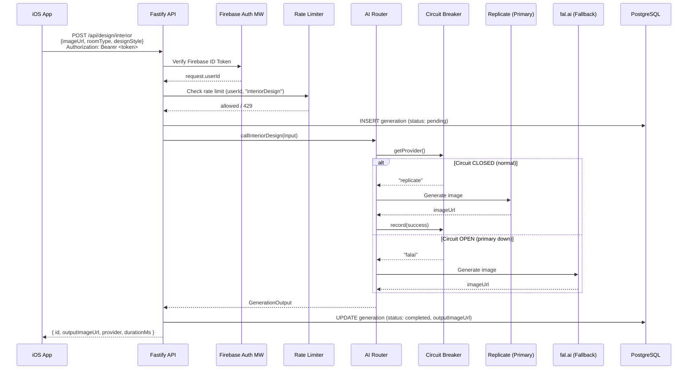
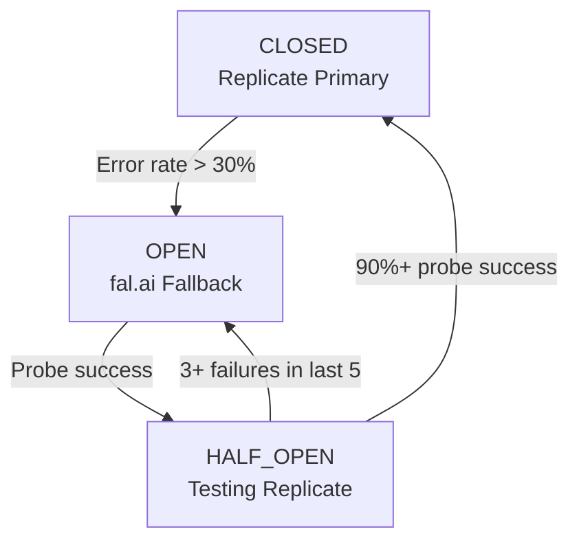

# feat: Interior Design AI Service with Provider Fallback

## Overview

HomeDecorAI-Backend'e ilk AI servisini ekliyoruz: Interior Design. Kullanici bir oda fotosu, oda tipi ve tasarim stili secer; backend bu veriyi AI modeline gonderip donusturulmus gorseli doner. Replicate (`prunaai/p-image-edit`) primary provider, fal.ai (`flux-2/klein/9b/edit`) fallback olarak kullanilir. Circuit breaker, retry, rate limiting ve Firebase Auth altyapisi Relook-Backend'den adapte edilir.

Mimari, ileride eklenecek diger tool'lar (exterior design, garden, object removal) icin genisletilebilir tasarlanir, ancak bu plan yalnizca Interior Design servisini kapsar.

## Problem Frame

iOS uygulamasi (HomeDecorAI) su anda AI backend'e baglanamayan bir wizard akisina sahip: kullanici foto secer, oda tipi ve stil belirler, ancak API call yapacak bir endpoint yok. Backend skeleton durumunda -- sadece health check endpoint'i mevcut, schema bos, auth yok.

Relook-Backend'de production'da calisan bir circuit breaker + fallback mekanizmasi var. Bu patikayi adapte ederek HomeDecorAI icin saglam bir AI servisi olusturulacak.

## Requirements Trace

- R1. iOS wizard'dan gelen foto URL, oda tipi ve tasarim stili ile AI gorsel uretimi yapilabilmeli
- R2. Primary provider (Replicate) basarisiz olursa otomatik olarak fallback (fal.ai) devreye girmeli
- R3. Firebase Anonymous Auth token dogrulamasi yapilmali
- R4. Kullanici basina rate limiting uygulanmali
- R5. Uretim gecmisi PostgreSQL'de tutulmali
- R6. Mimari, gelecekteki tool'lar icin genisletilebilir olmali
- R7. Circuit breaker durum degisikliklerinde Slack bildirimi gonderilmeli

## Scope Boundaries

- Sadece Interior Design tool'u implemente edilir
- Gorsel upload/storage iOS tarafinda kalir (backend image URL alir, upload yapmaz)
- Async job queue / polling pattern bu fazda yok -- senkron request-response
- Kullanici premium/free ayrimi bu fazda backend'de yapilmaz (iOS tarafinda kontrol edilir)
- Frontend (React) client hook'lari codegen ile olusur ama iOS entegrasyonu bu planin disinda

## Context & Research

### Relevant Code and Patterns

**Relook-Backend (referans repo):**
- `src/lib/circuit-breaker.ts` -- 3 durumlu circuit breaker (CLOSED/OPEN/HALF_OPEN), sliding window buffer, probe mekanizmasi
- `src/lib/providers.ts` -- `callEdit()` router fonksiyonu, `timedCall()` timeout wrapper, provider-specific adapter'lar
- `src/lib/retry.ts` -- Generic `withRetry<T>()` exponential backoff
- `src/lib/rate-limiter.ts` -- In-memory sliding window, per-user per-endpoint, minute/hourly/daily pencereler
- `src/plugins/auth.ts` -- Firebase ID token verification Fastify plugin, `request.userId` decoration
- `src/lib/firebase.ts` -- Firebase Admin SDK init, base64 service account key parsing
- `src/lib/slack.ts` -- Webhook-based Slack notifications for circuit breaker events
- `src/routes/edit.ts` -- `EDIT_TYPES` config pattern: her tip icin model, schema, process function, flags

**HomeDecorAI-Backend (mevcut):**
- `artifacts/api-server/src/app.ts` -- Fastify buildApp() with CORS, formbody, route prefix `/api`
- `artifacts/api-server/src/routes/health.ts` -- FastifyPluginAsync pattern, Zod validation
- `artifacts/api-server/src/lib/logger.ts` -- pino logger with redaction
- `lib/db/src/schema/index.ts` -- Bos schema, drizzle-zod pattern dokumante edilmis (yorum satirlari)
- `lib/api-spec/openapi.yaml` -- OpenAPI 3.1, Orval codegen
- `artifacts/api-server/build.mjs` -- esbuild config, `firebase-admin` zaten externals listesinde (satir 69)
- `artifacts/api-server/src/middlewares/.gitkeep` -- Middleware klasoru hazir, bos

**iOS App (tuketici):**
- `Features/Wizard/Models/RoomType.swift` -- 12 oda tipi enum
- `Features/Wizard/Models/DesignStyle.swift` -- 18 tasarim stili enum
- `Features/Wizard/ViewModels/InteriorDesignWizardViewModel.swift` -- 3 adimli wizard akisi
- `.cursor/rules/project-overview.mdc` -- Beklenen endpoint: `/generate/interior`

### External References

- Replicate `prunaai/p-image-edit`: https://replicate.com/prunaai/p-image-edit
- Fal.ai `flux-2/klein/9b/edit`: https://fal.ai/models/fal-ai/flux-2/klein-9b/edit

## Key Technical Decisions

- **Replicate primary, fal.ai fallback**: Relook-Backend'in tersine, burada Replicate primary. Circuit breaker'in `shouldUseFallback()` methodu buna gore calisir
- **Circuit breaker api-server/src/lib icinde**: In-memory state server process'e bagli, workspace package olarak paylasima uygun degil
- **`/api/design/interior` endpoint path'i**: iOS'un beklentisi `/generate/interior` idi ama backend'de semantic REST convention takip ediyoruz. iOS client bu path'e adapte edilecek
- **Senkron request-response**: AI uretimi 10-60 saniye surebilir. MVP icin senkron yeterli; Fastify `requestTimeout` arttirilacak. Async polling gelecek fazda eklenir
- **Prompt engineering ayri modul**: `prompts.ts` dosyasi room type + style kombinasyonunu human-readable prompt'a cevirir. Bu diger tool'lar eklendikce genisletilir
- **TOOL_TYPES pattern**: Relook'un `EDIT_TYPES` yaklasimi adapte edilir -- her tool tipi icin model, prompt builder, validation schema tek yerde tanimlanir
- **Generations tablosu**: Uretim gecmisi PostgreSQL'de tutulur. Analytics, debugging ve gelecekteki "gecmisim" ozelligi icin gerekli
- **`zod/v4` import path**: Workspace `zod@3.25.76` kullanir ve schema dosyalarinda `zod/v4` import path'i dokumante edilmis. `drizzle-zod@0.8.3` uyumlulugu implementation sirasinda dogrulanir

## Open Questions

### Resolved During Planning

- **Provider priority sorusu**: Kullanicinin belirttigi sekilde Replicate primary, fal.ai fallback
- **Image upload/storage**: Backend image URL alir, upload yapmaz. iOS goruntuleri bir CDN/storage'a yukleyip URL'i gonderir
- **DB schema gerekli mi?**: Evet -- generations tablosu analytics ve gecmis icin gerekli
- **Endpoint path convention**: `/api/design/interior` (semantic REST) vs `/api/generate/interior` (iOS beklentisi). REST convention secildi

### Deferred to Implementation

- **Replicate `prunaai/p-image-edit` exact API response format**: Model'in output field'lari (array vs single URL) implementation'da test edilecek
- **fal.ai `flux-2/klein/9b/edit` exact input mapping**: fal.ai client'in subscribe() method parametreleri implementation'da dogrulanacak
- **Prompt fine-tuning**: Ilk prompt template'leri best-effort olacak, gercek ciktilara gore iterasyon gerekecek
- **`drizzle-zod@0.8.3` ile `zod/v4` uyumlulugu**: Import path uyumlulugu implementation sirasinda test edilir
- **esbuild externals**: `replicate` ve `@fal-ai/client` paketlerinin bundle edilebilirligi build sirasinda dogrulanir

## High-Level Technical Design

> *This illustrates the intended approach and is directional guidance for review, not implementation specification. The implementing agent should treat it as context, not code to reproduce.*

## Implementation Units

### Phase 1: Foundation

- [ ] **Unit 1: Environment Config & Dependencies**

**Goal:** Environment variable validation ve AI provider dependency'lerinin eklenmesi

**Requirements:** R1, R2, R3

**Dependencies:** None

**Files:**
- Create: `artifacts/api-server/src/lib/env.ts`
- Modify: `artifacts/api-server/package.json`

**Approach:**
- Zod ile tum env var'lari validate eden bir modul. Server baslarken ilk import edilen dosya olacak, boylece eksik config erken yakalanir
- Required: `PORT`, `REPLICATE_API_TOKEN`, `FAL_AI_API_KEY`, `FIREBASE_SERVICE_ACCOUNT_KEY`, `DATABASE_URL`
- Optional: `SLACK_WEBHOOK_URL`, `LOG_LEVEL`, `NODE_ENV`
- `FIREBASE_SERVICE_ACCOUNT_KEY` base64-encoded JSON olarak gelir (Relook pattern'i: `Buffer.from(key, "base64").toString("utf-8")`)
- Dependencies ekle: `firebase-admin`, `replicate`, `@fal-ai/client`

**Patterns to follow:**
- `lib/db/src/index.ts` -- env var check pattern (ama Zod ile gelistirilecek)
- Relook `src/lib/firebase.ts` -- base64 service account parsing

**Test scenarios:**
- Happy path: Tum required env var'lar set -> config objesi dogru typed doner
- Error path: `REPLICATE_API_TOKEN` eksik -> aciklayici hata mesaji ile process.exit
- Error path: `FIREBASE_SERVICE_ACCOUNT_KEY` gecersiz base64 -> parse hatasi
- Edge case: `SLACK_WEBHOOK_URL` undefined -> config.slackWebhookUrl = undefined, hata yok

**Verification:**
- Server, tum env var'lar set edildiginde basariyla baslar
- Herhangi bir required env var eksik oldugunda aciklayici hata mesaji ile baslamaz

---

- [ ] **Unit 2: Database Schema -- Generations Table**

**Goal:** AI uretim gecmisini takip eden `generations` tablosu

**Requirements:** R5

**Dependencies:** None (Unit 1 ile paralel calisabilir)

**Files:**
- Create: `lib/db/src/schema/generations.ts`
- Modify: `lib/db/src/schema/index.ts`

**Approach:**
- Drizzle ORM ile `generations` tablosu tanimla
- Kolonlar: `id` (uuid PK), `userId` (text, indexed), `toolType` (text), `roomType` (text, nullable), `designStyle` (text, nullable), `inputImageUrl` (text), `outputImageUrl` (text, nullable), `prompt` (text), `provider` (text), `status` (text), `errorMessage` (text, nullable), `durationMs` (integer, nullable), `createdAt` (timestamp, default now)
- `drizzle-zod` ile `insertGenerationSchema` olustur
- `lib/db/src/schema/index.ts`'den export et
- `roomType` ve `designStyle` nullable cunku gelecek tool'lar farkli parametreler kullanabilir (R6)
- `toolType` alani genisletilebilirlik icin string (enum degil)

**Patterns to follow:**
- `lib/db/src/schema/index.ts` yorum satirlarindaki ornek pattern (satir 6-18)

**Test scenarios:**
- Happy path: Generation record insert ve geri okuma -> tum alanlar dogru
- Happy path: userId'ye gore sorgulama -> yalnizca o kullanicinin kayitlari doner
- Edge case: `outputImageUrl` null (basarisiz uretim) -> kayit basariyla olusur
- Edge case: `roomType` ve `designStyle` null (farkli tool tipi) -> kayit basariyla olusur

**Verification:**
- `pnpm run typecheck` basarili
- Schema dosyasi `lib/db/src/schema/index.ts`'den export ediliyor

---

### Phase 2: Middleware & Utilities

- [ ] **Unit 3: Firebase Auth Middleware**

**Goal:** Firebase ID token dogrulama ve `request.userId` decoration

**Requirements:** R3

**Dependencies:** Unit 1 (env config for FIREBASE_SERVICE_ACCOUNT_KEY)

**Files:**
- Create: `artifacts/api-server/src/middlewares/firebase-auth.ts`

**Approach:**
- `fastify-plugin` ile Fastify plugin olustur
- Firebase Admin SDK'yi env config'den alinan service account ile initialize et (singleton, module load'da)
- `fastify.decorate("authenticate", ...)` ile preHandler hook olustur
- `Authorization: Bearer <token>` header'dan token cikart
- `admin.auth().verifyIdToken(token)` ile dogrula
- Basarili -> `request.userId = decodedToken.uid`
- Basarisiz -> 401 JSON response
- User-Agent validation: `HomeDecorAI/` prefix'i (Relook'un `RelookApp/1` pattern'i)
- Health check gibi public route'lara uygulanmaz

**Patterns to follow:**
- Relook `src/plugins/auth.ts` -- fastify-plugin pattern, declare module augmentation
- Relook `src/lib/firebase.ts` -- Firebase Admin init, base64 parsing

**Test scenarios:**
- Happy path: Gecerli Firebase token -> request.userId set edilir, handler calisir
- Error path: Authorization header yok -> 401 `{ error: "Unauthorized", message: "..." }`
- Error path: Gecersiz/expired token -> 401
- Error path: Yanlis User-Agent -> 403
- Integration: Health check endpoint auth olmadan eriselebilir kaliyor

**Verification:**
- Auth gerektiren endpoint'e tokensiz istek 401 donuyor
- Gecerli token ile istek basarili

---

- [ ] **Unit 4: Circuit Breaker, Retry & Slack Notifications**

**Goal:** Provider fallback icin circuit breaker, retry utility ve Slack bildirimleri

**Requirements:** R2, R7

**Dependencies:** Unit 1 (env config for SLACK_WEBHOOK_URL)

**Files:**
- Create: `artifacts/api-server/src/lib/circuit-breaker.ts`
- Create: `artifacts/api-server/src/lib/retry.ts`
- Create: `artifacts/api-server/src/lib/slack.ts`

**Approach:**
- **Circuit Breaker**: Relook pattern'i adapte edilir, ancak yonler ters:
  - CLOSED = Replicate (primary)
  - OPEN = fal.ai (fallback)
  - HALF_OPEN = Replicate recovery test
  - `shouldUseFallback()` methodu (Relook'un `shouldUseReplicate()` yerine generic isim)
  - Ayni buffer boyutu (20), error threshold (%30), recovery threshold (%90)
  - `onTransition` callback for Slack notifications
  - Export singleton: `designCircuitBreaker` (Relook'un `editCircuitBreaker` yerine generic)
- **Retry**: Relook `withRetry()` birebir adapte -- generic, exponential backoff yok (sabit delay), maxRetries + delayMs + onRetry callback
- **Slack**: Relook pattern -- `notifySlack()` helper, circuit state transition mesajlari, no-op when webhook URL absent
- Probe job: Circuit OPEN oldugunda her 30 saniyede lightweight Replicate call. `onClose` hook ile temizlik

**Patterns to follow:**
- Relook `src/lib/circuit-breaker.ts` -- CircuitBreaker class, record/recordProbe, state transitions
- Relook `src/lib/retry.ts` -- withRetry pattern
- Relook `src/lib/slack.ts` -- Webhook notifications

**Test scenarios:**
- Happy path: Circuit breaker CLOSED baslar, `getProvider()` "replicate" doner
- Happy path: 20 request buffer'da %35 hata orani -> OPEN'a gecer, "falai" doner
- Happy path: OPEN durumda probe basarili -> HALF_OPEN'a gecer
- Happy path: HALF_OPEN'da 20 probe ile %90+ basari -> CLOSED'a doner
- Edge case: HALF_OPEN'da son 5 probe'da 3+ basarisiz -> OPEN'a geri doner
- Happy path: withRetry 1 retry ile: ilk cagri basarisiz, ikincisi basarili -> sonuc doner
- Error path: withRetry tum retry'ler basarisiz -> son hata throw edilir
- Happy path: Slack notification OPEN geciste gonderilir
- Edge case: SLACK_WEBHOOK_URL yok -> notification sessizce skip edilir, hata yok
- Edge case: Buffer 3'ten az kayit -> state degisikligi yapilmaz (erken evaluate etme)

**Verification:**
- Circuit breaker state gecisleri dogru calisiyor
- Retry basarisiz cagrilari tekrar deniyor
- Slack bildirimleri state gecislerinde gonderiliyor

---

- [ ] **Unit 5: Rate Limiter**

**Goal:** Kullanici basina, endpoint basina sliding window rate limiting

**Requirements:** R4

**Dependencies:** None (Unit 3 ile paralel calisabilir)

**Files:**
- Create: `artifacts/api-server/src/lib/rate-limiter.ts`
- Create: `artifacts/api-server/src/config/rate-limits.ts`

**Approach:**
- In-memory `Map<string, number[]>` -- key: `userId:endpoint`, value: timestamp array
- 3 pencere: minute, hourly, daily (Relook pattern)
- Configurable limitler `config/rate-limits.ts`'de:
  - `interiorDesign`: 5/min, 30/hour, 100/day
- `checkRateLimit(userId, endpoint)` fonksiyonu: allowed boolean + remaining counts + resetAt
- `createRateLimitPreHandler(endpoint)` fabrika fonksiyonu -> Fastify preHandler hook
- 429 response: `{ error: "Too Many Requests", retryAfter: seconds }`
- Periodic cleanup: her 60 saniyede expired entry'ler silinir (setInterval)
- Cleanup interval `onClose` hook ile temizlenir

**Patterns to follow:**
- Relook `src/lib/rate-limiter.ts` -- birebir pattern
- Relook `src/config/rate-limits.ts` -- config yapisisi

**Test scenarios:**
- Happy path: Ilk istek -> allowed, remaining decremented
- Happy path: Farkli kullanicilar bagimsiz limit'lere sahip
- Error path: Dakika limiti asildi -> 429 + `retryAfter` header
- Error path: Gunluk limit asildi -> 429
- Edge case: Expire olan timestamp'lar cleanup'ta silinir
- Edge case: Kullanici hic istek yapmamis -> `Map`'te kayit yok, allowed

**Verification:**
- Rate limit asildiktan sonra 429 donuyor
- `retryAfter` header dogru hesaplaniyor

---

### Phase 3: AI Integration & API

- [ ] **Unit 6: AI Provider Implementations & Prompt Engineering**

**Goal:** Replicate ve fal.ai provider adapter'lari, prompt builder, tool types registry

**Requirements:** R1, R2, R6

**Dependencies:** Unit 1 (env config), Unit 4 (circuit breaker, retry)

**Files:**
- Create: `artifacts/api-server/src/lib/ai-providers/types.ts`
- Create: `artifacts/api-server/src/lib/ai-providers/replicate.ts`
- Create: `artifacts/api-server/src/lib/ai-providers/falai.ts`
- Create: `artifacts/api-server/src/lib/ai-providers/router.ts`
- Create: `artifacts/api-server/src/lib/ai-providers/index.ts`
- Create: `artifacts/api-server/src/lib/prompts.ts`
- Create: `artifacts/api-server/src/lib/tool-types.ts`
- Test: `artifacts/api-server/src/lib/prompts.test.ts`

**Approach:**
- **types.ts**: `GenerationInput` (imageUrl, prompt, provider-specific params), `GenerationOutput` (imageUrl, provider, durationMs)
- **replicate.ts**: `callReplicate(input)` -- `prunaai/p-image-edit` model'ini cagir, 60s timeout. Replicate client'in `run()` veya `predictions.create()` + polling kullan. Output'tan image URL'i normalize et
- **falai.ts**: `callFalAI(input)` -- `fal-ai/flux-2/klein/9b/edit` model'ini `fal.subscribe()` ile cagir, 60s AbortSignal timeout. Output'tan image URL normalize et
- **router.ts**: `callDesignGeneration(input)` -- circuit breaker state'e gore provider sec, `withRetry()` ile sar, basari/basarisizlik circuit breaker'a kaydet. `timedCall()` pattern Relook'tan adapte
- **prompts.ts**: `buildInteriorDesignPrompt(roomType, designStyle)` -- camelCase enum degerlerini human-readable string'e cevir, prompt template'e yerlestir. Template: "Redesign this {roomType} in {designStyle} style. Keep structural elements intact. Transform all furniture and decor to match the {designStyle} aesthetic."
- **tool-types.ts**: `TOOL_TYPES` registry -- `interiorDesign` entry with model IDs, prompt builder reference, validation config. Gelecekte `exteriorDesign`, `gardenDesign` etc. eklenir

**Patterns to follow:**
- Relook `src/lib/providers.ts` -- timedCall, callEdit, callFalEdit, callReplicateEdit pattern
- Relook `src/routes/edit.ts` -- EDIT_TYPES config pattern

**Test scenarios:**
- Happy path: `buildInteriorDesignPrompt("livingRoom", "modern")` -> "living room" ve "modern" iceren prompt string
- Happy path: `buildInteriorDesignPrompt("midCentury", "artDeco")` -> "mid-century" ve "art deco" (camelCase -> human-readable)
- Happy path: Router, CLOSED state'de Replicate'i cagirir, basarili sonuc doner
- Happy path: Router, OPEN state'de fal.ai'yi cagirir, basarili sonuc doner
- Error path: Replicate timeout -> circuit breaker'a failure kaydedilir, retry calisir
- Error path: Her iki provider da basarisiz -> hata throw edilir
- Integration: Replicate basarisiz + circuit breaker OPEN'a gecer -> sonraki cagri otomatik fal.ai'ya yonlenir
- Edge case: Provider "no images" response -> aciklayici hata mesaji

**Verification:**
- Prompt builder tum room type + design style kombinasyonlari icin gecerli string uretiyor
- Router dogru provider'i seciyor ve circuit breaker state'i guncelliyor

---

- [ ] **Unit 7: OpenAPI Spec, Codegen & Route Handler**

**Goal:** Interior design endpoint'ini tanimla, codegen calistir, route handler implemente et

**Requirements:** R1, R3, R4, R5

**Dependencies:** Unit 2 (generations table), Unit 3 (auth), Unit 4 (circuit breaker), Unit 5 (rate limiter), Unit 6 (AI providers)

**Files:**
- Modify: `lib/api-spec/openapi.yaml`
- Create: `artifacts/api-server/src/routes/design.ts`
- Modify: `artifacts/api-server/src/routes/index.ts`
- Regenerated: `lib/api-zod/src/generated/` (by codegen)
- Regenerated: `lib/api-client-react/src/generated/` (by codegen)

**Approach:**
- **OpenAPI Spec**:
  - Yeni schemas: `RoomType` (12 deger string enum), `DesignStyle` (18 deger string enum), `InteriorDesignRequest`, `InteriorDesignResponse`, `ErrorResponse`
  - Yeni path: `POST /design/interior` with BearerAuth security
  - Yeni tag: `design`
  - Security scheme: `BearerAuth` (http, bearer, Firebase ID Token)
  - `InteriorDesignRequest`: `imageUrl` (string, uri), `roomType` ($ref RoomType), `designStyle` ($ref DesignStyle)
  - `InteriorDesignResponse`: `id` (uuid), `outputImageUrl` (uri), `provider` (string), `durationMs` (integer)
- **Codegen**: `pnpm --filter @workspace/api-spec run codegen` -> Zod schemas + React Query hooks
- **Route Handler** (`routes/design.ts`):
  1. `FastifyPluginAsync` pattern (mevcut health.ts gibi)
  2. `POST /interior` handler (prefix /design routes/index.ts'den gelir)
  3. preHandler: `[fastify.authenticate, createRateLimitPreHandler("interiorDesign")]`
  4. Request body'yi generated Zod schema ile validate et
  5. Prompt builder ile prompt olustur
  6. DB'ye "pending" generation kaydi insert et
  7. `callDesignGeneration()` ile AI provider'i cagir
  8. Basarili -> DB guncelle (completed + outputImageUrl), response don
  9. Basarisiz -> DB guncelle (failed + errorMessage), 500 don
- **Route Registration** (`routes/index.ts`):
  - `app.register(designRoutes, { prefix: "/design" })` ekle

**Patterns to follow:**
- `artifacts/api-server/src/routes/health.ts` -- FastifyPluginAsync, Zod validation pattern
- Relook `src/routes/edit.ts` -- preHandler array, error handling, response format

**Test scenarios:**
- Happy path: Gecerli request (imageUrl + roomType + designStyle + auth token) -> 200 + `{ id, outputImageUrl, provider, durationMs }`
- Error path: `roomType` alaninda gecersiz deger (ornegin "garage") -> 400 validation error
- Error path: `designStyle` eksik -> 400 validation error
- Error path: `imageUrl` gecersiz format -> 400 validation error
- Error path: Auth token yok -> 401
- Error path: Rate limit asildi -> 429
- Error path: AI provider tamamen basarisiz -> 500 + generation DB'de "failed" status
- Integration: Basarili generation -> DB'de "completed" kaydi + dogru outputImageUrl
- Integration: Codegen sonrasi `@workspace/api-zod`'da `InteriorDesignRequest` schema'si mevcut

**Verification:**
- `pnpm --filter @workspace/api-spec run codegen` hatasiz calisiyor
- `pnpm run typecheck` basarili
- `POST /api/design/interior` dogru response donuyor
- Generation kaydi DB'de olusturuluyor

---

### Phase 4: Integration & Wiring

- [ ] **Unit 8: App Wiring & Build Verification**

**Goal:** Tum parcalari birlestir, build ve typecheck dogrula

**Requirements:** R1, R2, R3, R4, R5, R6, R7

**Dependencies:** Unit 1-7

**Files:**
- Modify: `artifacts/api-server/src/app.ts`
- Modify: `artifacts/api-server/src/index.ts`
- Modify: `artifacts/api-server/build.mjs` (gerekirse externals ekle)

**Approach:**
- **app.ts**:
  - Firebase auth plugin register (formbody'den sonra)
  - Route registration: health (public) + design (auth + rate limit)
  - Fastify requestTimeout ayari (120s, AI islemleri uzun surebilir)
- **index.ts**:
  - `env.ts`'yi ilk import et (fail-fast)
  - Circuit breaker probe job baslat
  - `onClose` hook: probe interval + rate limiter cleanup interval temizle
  - 10 saniyede bir circuit breaker durumunu logla (Relook pattern)
- **build.mjs**:
  - `firebase-admin` zaten externals'da
  - `replicate` ve `@fal-ai/client` bundle test et. Basarisiz olursa externals'a ekle
- Fastify type augmentation: `request.userId` declaration `middlewares/firebase-auth.ts`'de

**Patterns to follow:**
- Relook `src/index.ts` -- server wiring, circuit breaker init, probe job, periodic logging
- Mevcut `artifacts/api-server/src/app.ts` -- plugin registration pattern

**Test scenarios:**
- Happy path: `pnpm run typecheck` root'tan basarili
- Happy path: `pnpm --filter @workspace/api-server run build` hatasiz calisir
- Happy path: `pnpm --filter @workspace/api-server run dev` server baslar
- Integration: `GET /api/healthz` -> 200 (auth yok, hala calisiyor)
- Integration: `POST /api/design/interior` end-to-end: auth + rate limit + AI call + DB kayit + response
- Error path: Required env var eksik -> server baslamaz, aciklayici hata

**Test expectation: none** -- Bu unit pure wiring; davranissal testler Unit 3-7'de tanimli

**Verification:**
- Typecheck, build ve dev server hatasiz calisiyor
- Health check ve design endpoint'leri birlikte calisiyor
- Circuit breaker durum loglari gorunuyor

## System-Wide Impact

- **Interaction graph:** Auth middleware -> tum `/design/*` route'larina uygulanir. Rate limiter -> endpoint basina preHandler. Circuit breaker -> AI provider cagrilarini yonlendirir. Slack -> circuit breaker state gecislerinde notify. DB -> her generation'da insert/update
- **Error propagation:** AI provider hatalari route handler'da yakalanir -> DB'de "failed" kaydedilir -> 500 response. Auth hatalari middleware'de yakalanir -> 401. Rate limit -> 429. Validation -> 400
- **State lifecycle risks:** Circuit breaker in-memory -- server restart'ta sifirlanir (kabul edilebilir). Rate limiter in-memory -- ayni risk. Generation DB kaydi "pending" kalabilir eger server crash olursa (orphaned records, ama analiz icin zarar vermez)
- **API surface parity:** iOS app icin yeni endpoint. Codegen ile React Query hook'lari da uretilir (simdilik kullanilmaz)
- **Integration coverage:** End-to-end test: auth token + request body + AI mock + DB verification. Circuit breaker state gecisleri + fallback calismasi
- **Unchanged invariants:** `GET /api/healthz` degismiyor. Mevcut OpenAPI spec'teki health endpoint korunuyor. DB'deki mevcut tablolar (yok, ama gelecekte eklenirse) etkilenmiyor

## Risks & Dependencies

| Risk | Mitigation |
|------|------------|
| AI provider response format degisikligi | Provider adapter'lar response'u normalize eder; format degisirse sadece adapter guncellenir |
| Senkron request 60s+ surebilir | Fastify requestTimeout 120s'ye cikarilir. Client-side timeout iOS'ta ayri handle edilir |
| In-memory state restart'ta kaybolur | Circuit breaker CLOSED baslar (safe default). Rate limiter sifirlanir (kullanici lehine) |
| `drizzle-zod` + `zod/v4` uyumlulugu | Implementation sirasinda test edilir. Uyumsuzluk durumunda manual Zod schema yazilir |
| Replicate/fal.ai API rate limiting | Provider-side rate limit'ler backend rate limiter'den bagimsiz. 429 response circuit breaker'a failure olarak kaydedilir |
| Prompt kalitesi | Ilk template best-effort. Production'da A/B test veya manuel iterasyon gerekebilir |

## Future Considerations

Bu kararlar mevcut tasarimi dogrudan etkiler:

- **Diger tool'lar** (exterior, garden, object removal): `TOOL_TYPES` registry'ye yeni entry + `prompts.ts`'e yeni builder + OpenAPI'ye yeni endpoint. Mevcut circuit breaker, retry, rate limiter, auth aynen kullanilir
- **Async processing**: Senkron model MVP icin yeterli. Uzun sureli islemler icin gelecekte job queue + polling/webhook pattern eklenebilir. `generations` tablosundaki `status` alani buna hazir
- **Image storage**: Simdilik iOS gorsel URL'i saglar. Gelecekte backend'in gorsel upload + CDN entegrasyonu gerekebilir

## Sources & References

- Related code: Relook-Backend `src/lib/circuit-breaker.ts`, `src/lib/providers.ts`, `src/routes/edit.ts`
- Related code: HomeDecorAI iOS `Features/Wizard/Models/RoomType.swift`, `Features/Wizard/Models/DesignStyle.swift`
- External docs: https://replicate.com/prunaai/p-image-edit
- External docs: https://fal.ai/models/fal-ai/flux-2/klein-9b/edit
