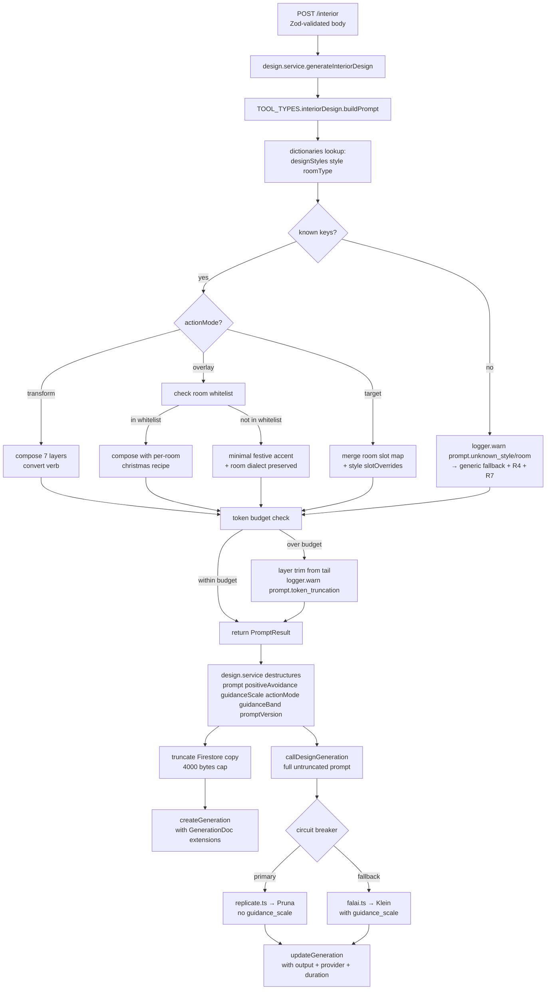

# Interior Design Prompt System Rewrite & Modular Prompt Architecture

## Overview

Rewrite `src/lib/prompts.ts` from a single generic 41-line template into a modular, extensible prompt system that composes rich style + room descriptors with shared primitives (structural preservation, photography quality, positive-avoidance). Rewire the tool builder contract to return a structured `PromptResult` object and thread style/mode metadata through the service and Firestore layers for post-launch observability. Extend the modular architecture so the eight currently-unimplemented tools (ExteriorDesign, VirtualStaging, GardenDesign, PaintWalls, FloorRestyle, CleanOrganize, ExteriorPainting, ReferenceStyle) can be added later as plug-in modules without reshaping the pipeline.

This plan intentionally adjusts several requirements from the origin brainstorm based on external research into the actual Flux Edit models used (Pruna p-image-edit on Replicate, fal-ai/flux-2/klein/9b/edit on fal.ai). The adjusted requirements are flagged explicitly in "Key Technical Decisions → Delta from Origin." (see origin: `docs/brainstorms/2026-04-10-002-interior-prompt-quality-requirements.md`)

## Problem Frame

The current interior design prompt builder is a single generic template that uses the same 5-sentence skeleton for all 216 {room × style} combinations. Stil bilgisi yalnızca kelime olarak enjekte edilir; oda tipi farkları yansıtılmaz; yapısal koruma direktifi zayıftır; Flux Edit modellerinin ihtiyaç duyduğu structural-preservation phrases, photography tokens, positive-avoidance içermez. Üstelik:

- Mevcut prompt "Redesign" verb'ünü kullanıyor — BFL Kontext guide bu verb'ü "complete change, risks losing identity" olarak özellikle uyarıyor
- Christmas, Airbnb, gamingRoom, stairway, underStairSpace, bathroom, kitchen gibi oda/stil'lerin semantik olarak farklı ele alınması gerekiyor ama mevcut kod tek bir iskeletten geçiriyor
- iOS wizard (`HomeDecorAI/HomeDecorAI/Features/Wizard/`) 12 oda × 18 stil seçim akışı sunuyor; BE bu seçimlerin %100'ünü karşılayacak niteliğe sahip değil

Bu plan, brainstorm'un R1–R26 gereksinimlerini araştırma bulgularına göre düzeltilmiş şekilde implement etmeyi hedefliyor ve ileride 8 tool'un aynı altyapıya plug-in olabileceği modüler yapıyı kuruyor.

## Requirements Trace

Brainstorm'daki R1–R26 gereksinimleri bu plana doğrudan bağlanır. Araştırma bulgularına göre düzeltilen gereksinimler (R16, R17, R1 verb) "Key Technical Decisions → Delta from Origin" altında listelidir. Plan, brainstorm'un hiçbir bölümünü sessizce düşürmez.

**Phase 0 validation (brainstorm P0.1–P0.6):**
- P0.1–P0.2. Baseline + cheap-fix A/B ölçümü → **U1**
- P0.3. Flux token budget verification → **U2**
- P0.4. Negative prompt schema probe (rejection behavior) → **U2**
- P0.5. Style-pick analytics pull → **U3**
- P0.6. User-outcome baseline (regen rate) → **U3**

**Prompt Anatomy (brainstorm R1–R7):**
- R1. Action directive (verb corrected: `convert/change/replace`, NOT `transform/redesign`) → **U9**
- R2. Style descriptor with `coreAesthetic, colorPalette, materials, signatureItems, lightingCharacter, moodKeywords, actionMode, guidanceBand, references` → **U4, U5, U8**
- R3. Room focus with slot map → **U4, U5, U7**
- R4. Structural preservation primitive → **U6**
- R5. Photography quality primitive → **U6**
- R6. Lighting & atmosphere → **U8, U9**
- R7. Positive-avoidance layer (reframed from "negative guidance" — embedded in positive prompt, NOT a separate negativePrompt field) → **U6, U9**

**Style Coverage (brainstorm R8–R11):**
- R8. All 18 styles with complete entries → **U8**
- R9. Christmas overlay + room whitelist + per-room recipes → **U7, U8**
- R10. Airbnb target mode + room-dialect slot interaction → **U7, U8**
- R11. Coverage test (>=10 styles produce non-trivial distinct outputs) → **U9** (builder owns the coverage assertion; U9's verification step adds the "10+ styles × 1 reference room → distinct outputs" manual smoke test)

**Room Coverage (brainstorm R12–R15):**
- R12. All 12 rooms with focus slots → **U7**
- R13. Bathroom/kitchen fixture-focused dialect → **U7**
- R14. stairway/entryway/underStairSpace non-furniture dialect → **U7**
- R15. GamingRoom setup dialect → **U7**

**Generation Pipeline (brainstorm R16–R18):**
- R16. ~~Negative prompt pipeline~~ **SUPERSEDED by positive-avoidance layer** (see Delta from Origin D1) → **no implementation units; R7 replacement via U6 positive-avoidance primitive**
- R17. Guidance scale bands (per-provider: Klein only, Pruna no-op) → **U5, U11**
- R18. API shape unchanged → preserved, no plan work needed

**Architecture & Extensibility (brainstorm R19–R26):**
- R19. Modular prompts/ directory structure → **U4**
- R20. Shared dictionaries across future tools → **U5, U8**
- R21. Tool-agnostic primitives with subject parameter → **U6**
- R22. Generic ToolTypeConfig with flexible PromptResult contract → **U10**
- R23. Only `interiorDesign` implemented this sprint; no placeholder tools → preserved
- R24. Graceful enum degradation (defense-in-depth for internal callers) → **U9**
- R25. Editorial validation (references field, startup validator) → **U5, U13**
- R26. Firestore prompt size cap (truncate-for-persistence-only) → **U12**

**New requirements surfaced during planning:**
- R27. GenerationDoc structured metadata extension (actionMode, guidanceBand, promptVersion) → **U12**
- R28. Provider capabilities module codifies Phase 0 findings → **U5**
- R29. Token budget runtime guard + build-time script → **U6, U13**

## Scope Boundaries

- iOS wizard (`HomeDecorAI/HomeDecorAI/Features/Wizard/`) is not touched. No wizard step, input control, or enum change.
- POST `/api/design/interior` request body (`src/routes/design.ts:65-82`) is not touched. No new fields, no schema regeneration.
- GET `/api/design/history` response shape is not touched. New `GenerationDoc` fields (actionMode, guidanceBand, promptVersion) are deliberately NOT exposed via `HistoryItem` or `GenerationHistoryItem` schemas.
- The other 8 tools (ExteriorDesign, VirtualStaging, GardenDesign, PaintWalls, FloorRestyle, CleanOrganize, ExteriorPainting, ReferenceStyle) are not implemented. Only the architecture shape is prepared so adding them later is mechanical. No placeholder `tools/` files for them.
- No LLM-based runtime prompt expansion; no multi-output + pick; no A/B infrastructure; no localization.
- No new env var surface unless Phase 0 findings demand it. Band → numeric tables live as code constants per brainstorm Key Decisions.
- No controller Zod schema loosening. R24 graceful degradation is intentionally internal-only (the controller gate at `src/routes/design.ts:74-81` rejects unknown enums with 400 by design).
- Circuit breaker (`src/lib/circuit-breaker.ts`), retry (`src/lib/retry.ts`), router (`src/lib/ai-providers/router.ts`) semantics are not touched. Only the input shape flows through them unchanged.

## Context & Research

### Relevant Code and Patterns

**Target surface (files to touch):**
- `src/lib/prompts.ts` — current 41-line builder, will become a barrel or disappear in favor of new subtree
- `src/lib/tool-types.ts` — `TOOL_TYPES` registry; `ToolTypeConfig` interface must become generic
- `src/services/design.service.ts` (line 63 — the single call site; lines 65-77 — createGeneration; line 80 — callDesignGeneration second arg)
- `src/lib/ai-providers/types.ts` — `GenerationInput` (unchanged for negativePrompt after research pivot; unchanged for guidanceScale since it's already there)
- `src/lib/ai-providers/replicate.ts` — guidance_scale conditional at line 22; NEW: must skip guidance_scale for Pruna specifically (per research)
- `src/lib/ai-providers/falai.ts` — guidance_scale conditional at line 21; already supports it
- `src/lib/ai-providers/router.ts` — logger.info lines 27, 42 — extend to include prompt metadata breadcrumbs
- `src/lib/firestore.ts` — `GenerationDoc` interface (line 9) and `updateGeneration` allowed-fields `Pick<>` set (lines 44-47) — extended per R27. `getGenerationsByUser` mapper must normalize `undefined → null` for old documents that predate R27 to avoid type drift (see ADV-007 residual risk).
- `src/index.ts` — bootstrap, where `validateDictionaries()` will be called between `const app = buildApp()` (line 58) and `app.listen(...)` (line 67). At this point dictionary modules are already loaded into memory (imports evaluate at import time), so the validator inspects fully-constructed dict objects.

**Conventions to mirror (from repo-research-analyst findings):**
- **File naming:** kebab-case (`tool-types.ts`, `circuit-breaker.ts`). New files in `src/lib/prompts/` follow the same: `design-styles.ts`, `rooms.ts`, `structural-preservation.ts`, `photography-quality.ts`, `positive-avoidance.ts`, `interior-design.ts`.
- **Symbol naming:** `PascalCase` types/interfaces, `camelCase` functions/variables, `SCREAMING_SNAKE_CASE` module-level catalog constants.
- **Import style:** ESM with `.js` extensions even for `.ts` sources: `import { X } from "./foo.js"`.
- **Section dividers:** `// ─── Section Name ───...` Unicode box-drawing (precedent: `src/services/design.service.ts:11, 42, 51, 116` and `src/controllers/design.controller.ts:14, 89`).
- **Logger call style:** pino two-arg form `logger.warn({ context }, "human-readable message")`. R24 / R29 / U14 introduce the `event:` discriminator field — this will be the first use in the codebase, placed inside the context object as `{ event: "prompt.unknown_style", designStyle, roomType }`.
- **Error handling:** no new custom error classes; `validateDictionaries()` may throw a plain `Error` at startup (bootstrap failures crash the process via `src/index.ts`).
- **Catalog types:** `as const` object maps keyed by an existing orval-generated `DesignStyle` / `RoomType` const map (`src/schemas/generated/types/designStyle.ts`, `src/schemas/generated/types/roomType.ts`). These files are READ-ONLY per orval header. The new dictionaries reference them as key sources.
- **Barrel pattern:** `src/lib/ai-providers/index.ts` is the only barrel in `src/lib/`; the new `src/lib/prompts/index.ts` follows the same thin re-export shape (only the public API: `buildInteriorPrompt`, `validateDictionaries`, `PromptResult` type).
- **TypeScript strictness:** individual strict flags set in `tsconfig.json` (`noImplicitAny`, `strictNullChecks`, `strictBindCallApply`, `strictPropertyInitialization`, `useUnknownInCatchVariables`, `alwaysStrict`, `noImplicitReturns`) — note `strict: true` umbrella is NOT set, so `strictFunctionTypes` is not implicitly enabled. Plan patterns (`as const satisfies`, generic `ToolTypeConfig`) do not depend on `strictFunctionTypes`. Uses narrow unions where natural.
- **Zod version note:** `src/lib/env.ts` uses `import { z } from "zod/v4"`, controllers use `import { z } from "zod"`. New lib files may use either; prefer matching the closest sibling.
- **Verify command:** there is NO `npm run test` or `npm run verify`. The closest equivalent is `npm run typecheck && npm run build`. Plan refers to this composite, not an invented `verify` script.

**Patterns NOT to mirror:**
- Relook-Backend circuit breaker polarity is inverted (fal.ai primary). Do NOT copy.
- Relook-Backend uses `enable_prompt_expansion: true` on fal.ai — this flag does NOT exist on the Klein 9B edit endpoint per fal.ai docs. Verify in U2 probe.

### Institutional Learnings

No `docs/solutions/` corpus exists in any of HomeDecorAI-Backend, HomeDecorAI (iOS), or Relook-Backend repos. There is no curated post-mortem / learnings record yet. This plan's observability additions (R29 token truncation warn log, U14 router mode logging) would be strong candidates to seed a first `docs/solutions/` entry post-implementation, but bootstrapping the learnings directory is out of scope here.

**Relook-Backend reference points** (code, not docs):
- `guidance_scale: 3.5` used in production for fal.ai Flux Edit hair color route → concrete starting point for U5 "balanced" band value (adjusted downward to 3.0 per fal Klein guide recommendation).
- fal.ai `enable_prompt_expansion: true` — exists on other fal.ai models but not on Klein 9B edit. U2 probe confirms behavior.
- Relook's `circuit-breaker.ts` and `retry.ts` were the template for HomeDecorAI's own implementations. No contract changes needed here.

### External References

**Authoritative sources (from best-practices-researcher Phase 1.3):**

- **Black Forest Labs — FLUX.2 Prompting Guide** (https://docs.bfl.ml/guides/prompting_guide_flux2)
  - Verbatim: "FLUX.2 does not support negative prompts. Focus on describing what you want, not what you don't want."
  - Sweet spot: 30-80 words medium / 80+ words complex. 150-200 words is upper edge.
  - Descriptive mode for text-to-image, instruction mode for edit models.
- **BFL — FLUX Kontext I2I Prompting Guide** (https://docs.bfl.ml/guides/prompting_guide_kontext_i2i)
  - Verb hierarchy: `transform` → risks losing identity (AVOID). `change` → controlled general. `replace` → 1:1 substitution. `convert` → best for style transfers. `add` → non-destructive insertions.
  - Structural preservation pattern: `"[change instruction] while [preservation instruction]"`.
  - Canonical interior preservation phrases: "maintain identical placement, camera angle, framing, and perspective" (verbatim). Variations for architecture: "preserve wall positions, window count, ceiling height, floor plan, lens perspective, vanishing points."
  - Pronoun pitfall: NEVER `her/it/this/that` in edit prompts — always re-name the entity.
- **HuggingFace — FLUX.1-dev token limit discussion** (https://huggingface.co/black-forest-labs/FLUX.1-dev/discussions/43)
  - Flux Schnell: T5 max sequence = **256 tokens**.
  - Flux Dev/Kontext: T5 max = **512 tokens**.
  - Flux 2: not published. CLIP encoder is always 77 tokens with a harmless warning; T5 is the real limit. **Truncation is silent in diffusers.**
- **fal.ai — Flux 2 Klein 9B Edit model page** (https://fal.ai/models/fal-ai/flux-2/klein/9b/edit)
  - Schema: `prompt` (req), `image_urls` (req), `seed`, `num_inference_steps` (default 28, range 4-50), `guidance_scale` (default 2.5, range 0-20), `image_size`, `sync_mode`, `enable_safety_checker`, `output_format`, `acceleration`. **No `negative_prompt`. No `enable_prompt_expansion`.**
- **Pruna docs — P-Image-Edit** (https://docs.pruna.ai/en/stable/docs_pruna_endpoints/performance_models/p-image-edit.html)
  - Schema: `images` (req), `prompt` (req), `reference_image`, `aspect_ratio`, `width`, `height`, `seed`, `disable_safety_checker`. **No `negative_prompt`, no `guidance_scale`, no `num_inference_steps`.** Distilled sub-second inference; no CFG control exposed.
- **fal.ai — Flux 2 Klein Prompt Guide** (https://fal.ai/learn/devs/flux-2-klein-prompt-guide)
  - "Prompts exceeding 100 words create confusion. Every word should serve a purpose."
  - Guidance bands (for generation, partially applicable to edit): 2-4 interpretive freedom, 5-8 strict adherence, >8 artifact risk.

**Implication for the plan**: `U11` provider layer changes must diverge per provider. Pruna receives only `prompt`, `image`, `aspect_ratio` / `width` / `height`, `output_format`, `seed` if set, `disable_safety_checker: false`, `go_fast: true`. fal.ai Klein receives `prompt`, `image_urls`, `num_inference_steps`, `guidance_scale`, `output_format`, `enable_safety_checker: true`. No negative prompt to either.

## Key Technical Decisions

### Delta from Origin Brainstorm (research-driven pivots)

These decisions deliberately diverge from the origin document. Each cites its external source. The origin doc remains as the product-intent record; this plan is authoritative for technical shape.

**D1. R16 reframe: drop `negativePrompt` from `GenerationInput`; R7 becomes always-embedded positive-avoidance layer in the positive prompt.**
- **Why:** BFL explicitly: *"FLUX.2 does not support negative prompts."* Neither Pruna p-image-edit nor fal-ai/flux-2/klein/9b/edit exposes a `negative_prompt` field. Origin R16 was based on an unverified assumption.
- **Additional why:** Inline `"avoid: ..."` syntax (origin R16 fallback) is harmful — Flux is not trained to interpret "avoid X" as "do not generate X"; the presence of the token can actively bias output toward X. BFL guide recommends *positive rephrasing*: "minimal clutter" not "no clutter"; "sharp focus" not "not blurry"; "rectilinear verticals" not "no fisheye distortion".
- **How it applies:** `GenerationInput` does NOT gain a `negativePrompt` field. R7 content is rewritten as positive descriptions of the desired opposite and is appended to every prompt's positive string tail. `PromptResult` still carries a `positiveAvoidance: string` field for Firestore logging queryability and for reconstructing the full composed prompt in post-launch debugging.
- **Brainstorm R16 text should be updated in a follow-up brainstorm pass; this plan treats the updated semantics as authoritative.**

**D2. R17 reframe: `guidance_scale` is Klein-only; Pruna receives no guidance parameter.**
- **Why:** Pruna docs list no `guidance_scale` field. Pruna is a distilled sub-second model with no CFG control. fal.ai Klein 9B has `guidance_scale` (default 2.5, range 0-20).
- **How it applies:** `PromptResult.guidanceScale` is still produced by the builder. The provider call path reads it. `falai.ts` passes it via the existing conditional spread. `replicate.ts` — when targeting Pruna — does NOT send `guidance_scale` at all (removing the existing line 22 conditional block for Pruna's code path; if a future Replicate model supports it, re-add conditionally based on model id).
- **Band values (starting points, to be tuned in Phase 0 / post-launch):**
  - `creative`: 2.0
  - `balanced`: 3.0 (default; fal Klein documented default is 2.5, Relook production uses 3.5, midpoint chosen)
  - `faithful`: 5.0
- Post-launch the band → numeric table is worth re-tuning with real outputs; the plan's values are starting points, not load-bearing claims.

**D3. Verb choice: use `convert` / `change` / `replace`, never `transform` or `redesign`.**
- **Why:** BFL Kontext guide explicitly warns `transform` "implies complete change, risks losing identity." Current `prompts.ts` uses `Redesign this` — this is risky for edit models.
- **How it applies:** R1 action directives use:
  - `actionMode: "transform"` → verb `convert` (e.g., "Convert this living room to a Scandinavian interior")
  - `actionMode: "overlay"` — **verb-split by whitelist (F4 refinement)**:
    - Whitelist rooms (`livingRoom`, `diningRoom`, `entryway`, `bedroom`): verb `preserve + add` (e.g., "Preserve the existing style of this living room and add festive Christmas decor"). These rooms typically have recognizable styling to preserve.
    - Non-whitelist rooms (`bathroom`, `kitchen`, `gamingRoom`, `office`, `homeOffice`, `studyRoom`, `underStairSpace`, `stairway`): verb `add + to` (e.g., "Add subtle festive accents to this bathroom, keeping vanity, mirror, fixtures, and tile pattern intact"). NEVER use "preserve existing style" for utilitarian rooms — it's a category error (either no style to preserve OR user expected transformation). The "add ... to" verb is stance-neutral about existing style.
  - `actionMode: "target"` → verb `stage + as` (e.g., "Stage this bedroom as a broadly appealing short-term rental space")
- Pronoun pitfall: never use `it/this/that` as shorthand within the prompt; always re-name the subject explicitly.

**D4. Token budget: target ~180 tokens composed, ≤200 for Pruna defensively, ≤250 for Klein.**
- **Why:** Flux Schnell T5 limit is 256 tokens (Pruna base model is unverified — defensively assume Schnell-class). Flux 2 limit is unpublished. fal Klein guide: "prompts exceeding 100 words create confusion." Silent truncation in diffusers; no error.
- **How it applies:**
  - Builder composes layers in priority order: R1 → R3 → R2(coreAesthetic+colorPalette) → R4 → R7 → R2(materials+signatureItems) → R5 → R6.
  - Runtime token counter (approximate via a simple heuristic: 1 token ≈ 0.75 English words, rounded up; or a lightweight tokenizer dependency like `gpt-tokenizer` if accuracy is needed) trims layers from the **tail** (lowest priority: R6 lighting → R5 photography → R2 materials) until the composition fits the provider's budget.
  - When trimming occurs, `logger.warn({ event: "prompt.token_truncation", designStyle, roomType, droppedLayers, finalTokens, provider }, "Prompt trimmed to fit token budget")` is emitted.
  - Build-time script (`scripts/check-prompt-budget.ts`, invoked via `npm run check:prompts`) iterates all 216 combinations × 2 providers, asserts none require runtime trimming under normal inputs, and fails with exit code 1 if any does. This is the hard guardrail; the runtime trim is a last-resort safety net.

**D5. R24 graceful degradation is internal-only defense-in-depth.**
- **Why:** Two validation layers reject unknown enums with 400 before the service runs: (a) the Fastify route schema enum at `src/routes/design.ts:74-81` (OpenAPI-level body validation), and (b) the Zod parser `CreateInteriorDesignBody.safeParse(request.body)` inside `src/controllers/design.controller.ts:26-35` (runtime validation). R24's "user does not see 5xx" benefit cannot be produced through HTTP without loosening both layers, which this sprint does NOT do.
- **How it applies:** `buildInteriorPrompt()` still handles unknown keys by falling back to a generic skeleton + R4 + R7 primitives and emitting `logger.warn({ event: "prompt.unknown_style" | "prompt.unknown_room", ... }, "...")`. This protects future internal callers (jobs, retries, direct lib consumers). The plan does NOT loosen the orval-generated schema. The `validateDictionaries()` startup check catches most drift at boot time; the runtime fallback is defense-in-depth.

**D6. GenerationDoc extension (new R27):** add `actionMode`, `guidanceBand`, `promptVersion` to the Firestore document so post-launch analytics can slice regeneration/save rates by these dimensions. These fields are **write-once at creation** (not updatable via `updateGeneration`). They are NOT exposed via `HistoryItem` or `GenerationHistoryItem`.

### Design decisions (not reviewer pivots)

**D7. Module layout:** `src/lib/prompts.ts` becomes `src/lib/prompts/index.ts` (barrel). New subtree:
```
src/lib/prompts/
├── index.ts                    # public API: buildInteriorPrompt, validateDictionaries, PromptResult type
├── types.ts                    # PromptResult, StyleEntry, RoomEntry, ChristmasRecipe, ActionMode, GuidanceBand
├── validate.ts                 # validateDictionaries() — called from src/index.ts bootstrap
├── dictionaries/
│   ├── design-styles.ts        # 18 StyleEntry objects keyed by DesignStyle
│   ├── rooms.ts                # 12 RoomEntry objects keyed by RoomType (with slot map)
│   └── christmas-recipes.ts    # per-room Christmas recipes for whitelist (livingRoom, diningRoom, entryway, bedroom)
├── primitives/
│   ├── structural-preservation.ts   # tool-agnostic with subject parameter
│   ├── photography-quality.ts       # tool-agnostic with subject parameter
│   └── positive-avoidance.ts        # universal positive-avoidance tail
└── tools/
    └── interior-design.ts      # interiorDesign tool builder; composes layers, branches on actionMode, handles graceful degradation
```
This resolves origin Deferred Question "prompts/ alt klasör mü yoksa lib/prompts.ts mi?" → subfolder with barrel. The existing `src/lib/ai-providers/` subtree is the precedent.

**D8. Provider capabilities module:** new file `src/lib/ai-providers/capabilities.ts` exports a map **keyed by model id** (not provider name) so multiple models per provider can coexist with distinct capabilities:

```
PROVIDER_CAPABILITIES: Record<string, ProviderCapabilities> = {
  "prunaai/p-image-edit":        { provider: "replicate", supportsNegativePrompt: false, supportsGuidanceScale: false, maxPromptTokens: 200, defaultAspectRatio: "16:9" },
  "fal-ai/flux-2/klein/9b/edit": { provider: "falai",     supportsNegativePrompt: false, supportsGuidanceScale: true,  maxPromptTokens: 250, defaultImageSize: "landscape_4_3" }
}
```

- `replicate.ts` looks up `PROVIDER_CAPABILITIES[model]` at call time and gates `guidance_scale` on `supportsGuidanceScale`.
- `falai.ts` does the same.
- The builder (U9) reads `maxPromptTokens` for the primary provider (Replicate/Pruna, tighter of the two).
- The U2 probe script updates this file based on Phase 0 findings via manual transcription — the probe outputs a markdown table, a human reads it and updates the constants.
- When a future model is added (e.g., ExteriorDesign uses `fal-ai/flux-2/dev/edit`), the map gains a new entry and neither provider file needs to change.

This resolves R28 with the "keyed by model id" fix from ADV-008.

**D9. Generic `ToolTypeConfig`:** rewritten as
```
interface ToolTypeConfig<TParams = Record<string, string>, TResult extends PromptResult = PromptResult> {
  models: { replicate: `${string}/${string}`; falai: string };
  buildPrompt: (params: TParams) => TResult;
}
```
`TOOL_TYPES.interiorDesign` is typed as `ToolTypeConfig<InteriorParams, PromptResult>`. Future tools (VirtualStaging with `referenceImageUrl`, GardenDesign with `seasonHint`) can extend `PromptResult` with additional fields without breaking the registry. Provider call path reads only the base `PromptResult` fields.

**D10. Christmas recipe location:** `src/lib/prompts/dictionaries/christmas-recipes.ts` (separate file, keyed by RoomType). The `designStyles.christmas` entry has a `recipeRef: "christmas-recipes"` marker; the builder knows to look up per-room recipes only when `actionMode === "overlay"` AND style is in a whitelist of overlay-style entries. This keeps `rooms.ts` tool-agnostic (per R20) and concentrates seasonal overlay logic in one place. Future seasonal overlays (halloween, diwali) can live alongside.

**D11. Target-mode × room-dialect interaction model:** typed slot map.
- `RoomEntry` contains `slots: { furnitureDialect: string, lightingDialect: string, materialDialect?: string, personalization?: string, setupCharacter?: string }` — what the room dict provides per slot.
- `actionMode: "target"` can override specific slots from the style entry: `target.slotOverrides: { personalization?: string, ambientLighting?: string }`.
- Builder composes R3 by merging room slots with style overrides (style overrides take precedence where present).
- Example: `airbnb + gamingRoom` → room provides `setupCharacter: "ergonomic multi-monitor desk, cable management"`; style overrides `personalization: "neutralized, minimal personal items"` and `ambientLighting: "bright neutral LED task lighting"`. R3 composition sees all three slots.

**D12. Empty-layer handling:** hard-fail at startup via `validateDictionaries()` (new `src/lib/prompts/validate.ts`). Called from `src/index.ts` bootstrap right after `env` validation, before `fastify.listen`. Throws if any style is missing any R2 field (including `references: string[]` with length ≥ 3 per R25) or any room is missing its slot map. This makes R8, R12, R25 enforceable at boot and prevents typo-driven production regressions.

**D13. Firestore truncation placement:** truncate **only the Firestore copy**. Builder returns the full composed prompt in `PromptResult.prompt`; provider call uses the full string; `design.service.ts` passes the full prompt to `callDesignGeneration`; right before `createGeneration({...})`, the service applies `truncatePrompt(prompt, MAX_FIRESTORE_PROMPT_BYTES)` (new helper) which keeps up to 4000 bytes and appends `"\n...[truncated]"` if it had to trim. Pattern follows existing precedent `errorMessage.slice(0, 500)` at `src/services/design.service.ts:104`.

**D14. Orval-generated schema stays untouched.** `src/schemas/generated/types/designStyle.ts` and `src/schemas/generated/types/roomType.ts` are read-only per orval header. New dictionaries import their `DesignStyle` / `RoomType` const maps as the key source, but never mutate or wrap them.

**D15. Logger `event:` discriminator is introduced here.** The codebase has no prior `event:` field convention (grep across `src/` returns zero matches). This plan introduces it in three places: `prompt.unknown_style`, `prompt.unknown_room`, `prompt.token_truncation`. The structured shape is `logger.warn({ event, ...context }, "human-readable message")`. Future code should adopt the same pattern; a short note is added to U14's docs reference.

**D16. No test framework introduced; verification uses TypeScript + build + runtime smoke checks.** The repo has no `test` script, no vitest, no jest, no `node:test` today. Adding a test framework is out of scope. For this plan, verification relies on:
- `npm run typecheck && npm run build` (hard gate)
- `npm run check:prompts` (new script, token budget check over all 216 combos)
- Manual smoke: issue a POST `/api/design/interior` with 5 representative {style × room} pairs against a dev Firebase/Replicate/fal credentials and verify (a) 200 response, (b) Firestore doc shape, (c) logs contain the expected `event:` breadcrumbs when applicable
- Test scenario sections in each implementation unit describe WHAT should be tested; the first team member to introduce a test framework post-plan can implement them verbatim

**D17. Production safety valves (F2 — rollback mechanism).** Because this sprint rewrites the prompt system that drives every interior-design generation in production, AND the atomic U10+U12 cutover deletes the legacy builder, the plan includes two runtime safety valves that allow operators to roll back without a code revert + redeploy cycle:

1. **`PROMPT_BUILDER_VERSION` env var** — values `"legacy" | "v1"`, default `"v1"`. At `tool-types.ts:11`, the `TOOL_TYPES.interiorDesign.buildPrompt` dispatch reads this env var and routes to either the new `buildInteriorPrompt` (v1) or a preserved `buildInteriorPromptLegacy` (legacy). This means:
   - The old builder is NOT deleted in U10. It is **renamed and preserved** as `buildInteriorPromptLegacy` inside `src/lib/prompts/legacy.ts` (wrapping the old 41-line generic template). It returns a `PromptResult` object for contract parity (guidanceBand defaults to "balanced", actionMode defaults to "transform", promptVersion defaults to "interiorDesign/legacy").
   - If post-launch regen rate regresses, operator flips the env var to `"legacy"` and redeploys (or hot-reloads if the runtime supports it). Zero code changes. Full revert takes <5 minutes.
   - Env var is added to `src/lib/env.ts` with default `"v1"`; invalid values crash bootstrap (consistent with env fail-fast pattern).

2. **`DICTIONARY_STRICT_MODE` env var** — values `"strict" | "degraded"`, default `"strict"`. In `validateDictionaries()`, if set to `"degraded"`, validation failures log a `logger.error({event: "prompt.dictionary_degraded", missingFields}, "Dictionary incomplete — running in degraded mode")` but do NOT throw. In degraded mode, any call to `buildInteriorPrompt` with a style/room key that has missing fields falls back to the R24 generic skeleton (same path as unknown enums). This prevents content typos from causing total production outage: the server still starts, generations still work (with degraded quality for the specific affected combos), and operators have time to diagnose without a crash loop.

These safety valves add ~30 lines of code plus two env-var declarations. They are explicitly not in the original brainstorm or in scope boundaries — they were added per document-review F2 finding as a production safety requirement. Both env vars are documented in `.env.example` updates during U5.

## Open Questions

### Resolved During Planning

- **Flux models and negative prompt support** → neither supports it; R7 reframed as positive-avoidance layer (D1).
- **Flux models and guidance scale** → Pruna has none; Klein default 2.5 range 0-20; bands calibrated (D2).
- **Verb choice for edit prompts** → convert / change / replace / add. Never transform / redesign (D3).
- **Token budget targets** → ≤200 Pruna, ≤250 Klein, ~180 target composition (D4).
- **R24 reachability** → internal-only defense-in-depth, controller Zod intentional (D5).
- **Module layout** → subfolder with barrel (D7), pattern from `src/lib/ai-providers/`.
- **Christmas recipe location** → separate `christmas-recipes.ts` keyed by room (D10).
- **Target-mode interaction model** → typed slot map (D11).
- **Empty layer handling** → hard-fail at startup (D12).
- **Firestore truncation** → persistence-only, full prompt to provider (D13).
- **Test framework** → not introduced this sprint (D16); verification via typecheck/build/probe script/manual smoke.

### Deferred to Implementation

- **Exact token counting approach:** simple heuristic (`words × 1.33 ≈ tokens`, rounded) vs a real T5 tokenizer library (`gpt-tokenizer` or `tiktoken` with T5 model). Heuristic is dependency-free; real tokenizer is accurate. Decide during U6 based on how tight budgets run. If budget check script (U13) has frequent false positives/negatives, swap to real tokenizer.
- **Exact band → numeric table calibration:** starting values (creative=2.0, balanced=3.0, faithful=5.0) are defensive. Post-launch, a 3x3 grid sweep (3 prompts × 3 guidance) on representative inputs tunes per-band. No production decision needs to be made before ship.
- **Dictionary content authoring method:** hand-authored vs one-time LLM-assisted bootstrap + manual review. Out of plan scope — Yusuf as single-owner editorial per R25 decides during U8.
- **`gpt-tokenizer` / `tiktoken` dependency choice** (if a real tokenizer is needed for U6/U13). Defer until token budget script hits an accuracy issue.
- **Exact runtime layer-drop order when token budget exceeded:** plan specifies "drop from tail priority" but the exact priority (R6 → R5 → R2 materials → R2 signatureItems → ...) should be empirically verified during U6 implementation. Bad drops can regress quality; plan's suggested order is the starting hypothesis.
- **Provider probe script output format:** U2 writes findings back into `src/lib/ai-providers/capabilities.ts` manually or the script generates a file. Decide during U2.
- **`promptVersion` string format:** e.g., `"interiorDesign/v1.0"` or `"v1-2026-04-10"`. Pick during U12; only needs to be stable and grep-able. Do not block on this.

## High-Level Technical Design

> *This illustrates the intended approach and is directional guidance for review, not implementation specification. The implementing agent should treat it as context, not code to reproduce.*

### Composition Flow (per request)



Key signal: `PromptResult` carries **three layers of information** that flow through:
1. **Model input layer** — `prompt`, `guidanceScale` (used by providers)
2. **Persistence layer** — `actionMode`, `guidanceBand`, `promptVersion`, `positiveAvoidance`, truncated prompt copy (written to Firestore)
3. **Observability layer** — events emitted along the path (`prompt.unknown_*`, `prompt.token_truncation`, router mode breadcrumbs)

### PromptResult Shape (directional)

```
interface PromptResult {
  prompt: string                    // full composed positive prompt incl. R7 positive-avoidance tail
  positiveAvoidance: string         // just the R7 tail, for metrics / logging
  guidanceScale: number             // used by fal.ai; ignored by Pruna at provider layer
  actionMode: "transform" | "overlay" | "target"  // metadata for Firestore
  guidanceBand: "creative" | "balanced" | "faithful"  // metadata for Firestore
  promptVersion: string             // metadata for post-launch A/B attribution
}
```

Note: no `negativePrompt` field. D1 reframe — the R7 content lives inside `prompt` and is mirrored in `positiveAvoidance` for observability.

### Provider Capability Matrix

| Capability | Replicate (Pruna p-image-edit) | fal.ai (Klein 9B edit) |
|---|---|---|
| `prompt` | ✓ | ✓ |
| `image` / `image_url(s)` | `image` (singular, current code) | documented schema uses `image_urls` (array); current code uses `image_url` (singular) at `falai.ts:18` which fal.ai Klein accepts — do NOT refactor to `image_urls` unless U2 probe shows the singular form starts failing |
| `negative_prompt` | ✗ (not in schema) | ✗ (not in schema) |
| `guidance_scale` | ✗ (not in schema; distilled model) | ✓ (default 2.5, range 0-20) |
| `num_inference_steps` | ✗ | ✓ (default 28, range 4-50) |
| `seed` | ✓ | ✓ |
| Output format | `output_format` defaults `jpg` | `output_format` defaults `jpeg` |
| Safety checker | `disable_safety_checker: false` | `enable_safety_checker: true` |
| Acceleration | `go_fast: true` (current) | `acceleration: "regular"` (add via U11 optionally) |
| Max prompt tokens (defensive) | ~200 (assume Schnell-class T5=256) | ~250 (Flux 2 family, unpublished) |
| Current repo input idiom | imperative `Record<string, unknown>` mutation (`replicate.ts:15-25`) | declarative spread (`falai.ts:15-28`) |

### Directory Delta (before → after)

```
BEFORE:
src/lib/prompts.ts        (41 lines, single function)
src/lib/tool-types.ts     (registry with buildPrompt: (params) => string)

AFTER:
src/lib/prompts/index.ts                           (barrel)
src/lib/prompts/types.ts                           (PromptResult + dict entry types)
src/lib/prompts/validate.ts                        (validateDictionaries)
src/lib/prompts/dictionaries/design-styles.ts      (18 style entries)
src/lib/prompts/dictionaries/rooms.ts              (12 room entries with slot maps)
src/lib/prompts/dictionaries/christmas-recipes.ts  (4 whitelist recipes)
src/lib/prompts/primitives/structural-preservation.ts
src/lib/prompts/primitives/photography-quality.ts
src/lib/prompts/primitives/positive-avoidance.ts
src/lib/prompts/tools/interior-design.ts           (builder + composition + graceful fallback)
src/lib/ai-providers/capabilities.ts               (NEW — PROVIDER_CAPABILITIES constants)
src/lib/tool-types.ts                              (updated: generic ToolTypeConfig)
src/services/design.service.ts                     (updated: destructure PromptResult, truncate Firestore copy, write structured metadata)
src/lib/ai-providers/types.ts                      (unchanged re negativePrompt; unchanged re guidanceScale already present)
src/lib/ai-providers/replicate.ts                  (updated: skip guidance_scale for Pruna)
src/lib/ai-providers/falai.ts                      (updated: unchanged for guidance; use acceleration if adopted)
src/lib/ai-providers/router.ts                     (updated: log mode breadcrumbs in circuit-breaker fallback lines)
src/lib/firestore.ts                               (updated: GenerationDoc extended with actionMode, guidanceBand, promptVersion)
src/index.ts                                       (updated: call validateDictionaries() on bootstrap)
scripts/check-prompt-budget.ts                     (NEW — 216-combo token budget script)
scripts/probe-providers.ts                         (NEW — Phase 0 provider capability probe)
package.json                                       (updated: add check:prompts + probe:providers scripts)
```

## Implementation Units

Plan is organized into 5 phases with 14 implementation units. Phase 0 is blocking: U1–U3 MUST complete before U4 begins. Phase 1–4 within are dependency-ordered but loosely parallelizable among themselves.

### Phase 0: Pre-Implementation Validation (blocking)

- [ ] **Unit 1: Prompt baseline & cheap-fix A/B harness**

**Goal:** Produce empirical evidence that the premise of this rewrite (richer prompts → meaningfully better output) holds, per brainstorm P0.1 and P0.2. Either confirms the full 7-layer plan is worth shipping, or scopes it down to a cheap fix if the cheap fix already solves most failures.

**Requirements:** P0.1, P0.2 (brainstorm Phase 0)

**Dependencies:** None

**Files:**
- Create: `scripts/baseline-prompts.ts`
- Reference: `src/lib/prompts.ts` (current baseline), `src/lib/ai-providers/router.ts` (dispatch path)
- Output: `docs/research/2026-04-10-prompt-baseline-findings.md` (created by this unit)

**Approach:**
- Script reads 20–30 {style × room} combinations from a hand-picked representative set (5 styles × 5 rooms + 3–5 edge cases: christmas+bathroom, airbnb+gamingRoom, stairway+minimalist, bathroom+luxury, entryway+japandi).
- Uses a stable set of test room photos (hardcoded URLs in the script, or references to S3 bucket test fixtures if convenient).
- Run 1 (baseline): current `buildInteriorDesignPrompt` unmodified.
- Run 2 (cheap fix): prompt string augmented with (a) a hardcoded structural-preservation clause ("while maintaining identical camera angle, wall positions, window count, ceiling height, and lens perspective") and (b) a positive-avoidance tail ("minimal clutter, sharp focus, rectilinear verticals, natural color balance") and (c) verb change from "Redesign" to "Convert".
- Both runs call the same provider (primary: Pruna p-image-edit via Replicate) for fair comparison.
- Human rater (Yusuf) labels each output: `acceptable | wrong-style | structural-drift | photo-quality | model-artifact`.
- Script writes summary to `docs/research/2026-04-10-prompt-baseline-findings.md` with per-combination comparison, failure-mode counts, and a recommendation: "cheap fix sufficient" or "full R1-R7 rewrite warranted".

**Execution note:** This unit produces human-judged data, not code that ships to production. Script lives under `scripts/` (new directory, alongside future U2 probe script) and is not bundled into `dist/`.

**Patterns to follow:**
- Structured logging via pino (`src/lib/logger.ts`) — the script should emit one log line per output.
- No test framework needed for this unit — it's a one-off research script.

**Test scenarios:**
- Test expectation: none — this unit is an empirical investigation harness, not production code.

**Verification & pre-committed decision rule (F1):**

Before running U1, commit to the following binary decision rule (prevents sunk-cost bias toward the full rewrite):

- **"Cheap fix sufficient" trigger** — ALL three conditions must hold:
  1. `(structural-drift + wrong-style)` combined labels drop by **≥50%** from baseline to cheap-fix run
  2. `model-artifact` labels do NOT increase (cheap fix must not introduce new failure modes)
  3. Edge-case combinations (christmas+bathroom, airbnb+gamingRoom, stairway+minimalist) show **no worse** structural fidelity than baseline
- **"Full rewrite warranted" trigger** — ANY of:
  1. Combined `(structural-drift + wrong-style)` reduction is **<30%** (cheap fix doesn't move the needle)
  2. Cheap fix introduces new `model-artifact` failures
  3. Edge-case combinations regress
- **"Ambiguous middle" (30–50% reduction, no regressions)** — default to SHIP cheap fix only. Document the ambiguity in findings, defer full rewrite until a second round of evidence is gathered.

Deliverables:
- `docs/research/2026-04-10-prompt-baseline-findings.md` exists with: per-combination labels (baseline + cheap-fix), aggregate failure-mode counts, the trigger condition met, and the resulting scope decision.
- If cheap fix ships: the "cheap fix" itself is the U1 output and is promoted to production as a 1-day fix (see F2 safety-valve path). The plan re-scopes to a minimal U4, U6 (primitives only), U11 (guidance_scale routing only), U12 (minimal service changes). U7, U8, U9, U10, U13 become out of scope. **Success Criteria user-outcome metric still applies to the cheap-fix shipped version.**
- If full rewrite: Phase 1-4 proceed as planned.

---

- [ ] **Unit 2: Provider capability probe script**

**Goal:** Empirically determine what each provider actually accepts and rejects. Resolves brainstorm P0.3 (token budget), P0.4 (negative prompt schema), and seeds `src/lib/ai-providers/capabilities.ts` (R28) with verified values.

**Requirements:** P0.3, P0.4, R28 (new)

**Dependencies:** None (can run in parallel with U1)

**Files:**
- Create: `scripts/probe-providers.ts`
- Output (human-readable): `docs/research/2026-04-10-provider-capability-probe.md`
- Output (machine-readable): `scripts/fixtures/provider-capabilities.json` — structured JSON matching the shape of `PROVIDER_CAPABILITIES` in `capabilities.ts`. This file is the mechanical handoff to U5 (F5 refinement).
- Seeds: `src/lib/ai-providers/capabilities.ts` (created in U5; U5 reads `scripts/fixtures/provider-capabilities.json` and renders the TypeScript module mechanically rather than manually transcribing findings)

**Approach:**
- Script makes deliberate test calls to both providers with:
  - A baseline minimal prompt (known to succeed) — establishes ground truth for "this call works"
  - A prompt with `negative_prompt` field added — observes 422 vs silent drop
  - A prompt with `enable_prompt_expansion` field added (fal.ai only) — observes schema reaction
  - A prompt with `guidance_scale: 5.0` (both providers) — Pruna should 422 or silent drop, Klein should succeed
  - A prompt with deliberately long content (~280 T5 tokens, ~200 English words) — observes output quality signal for truncation (is output identifiably worse on the tail of the prompt?)
  - A prompt with deliberately very long content (~500 T5 tokens, ~375 English words) — definitely exceeds any Flux limit; observes if 422, silent truncation, or degraded output
- For each call, log: `{providerId, modelId, requestedFields, responseStatus, durationMs, outputDimensions, notableArtifacts}`.
- Write findings to `docs/research/2026-04-10-provider-capability-probe.md` with a definitive table of: `{field}: {accepted | 422 rejected | silent drop}` per provider, plus estimated max prompt tokens per provider.

**Execution note:** This is a script that costs a few dollars in API calls. Run manually, do not wire to CI. Needs valid REPLICATE_API_TOKEN and FAL_AI_API_KEY via `.env` (existing).

**Patterns to follow:**
- Reuse env loading from `src/lib/env.ts` (note: script needs to import from compiled output or via ts-node; decide during implementation).
- Do NOT route through the circuit breaker — direct SDK calls to each provider.

**Test scenarios:**
- Test expectation: none — one-off research script. The "test" is whether the findings make the provider behavior unambiguous.

**Verification:**
- `docs/research/2026-04-10-provider-capability-probe.md` contains a clear table of provider field support and concrete token budget numbers (human-readable narrative of findings).
- `scripts/fixtures/provider-capabilities.json` exists and contains structured data matching the `Record<ModelId, ProviderCapabilities>` shape: `{ "prunaai/p-image-edit": { provider, supportsNegativePrompt, supportsGuidanceScale, maxPromptTokens, ... }, "fal-ai/flux-2/klein/9b/edit": {...} }`. This is the machine-readable handoff.
- The external-research assumptions (D1: no negative_prompt; D2: Pruna has no guidance_scale; D4: ≤200/≤250 token budgets) are either confirmed or adjusted based on empirical findings in the JSON.
- **F5 mechanical handoff:** Findings are read from `scripts/fixtures/provider-capabilities.json` in U5's capability module generation step. There is NO manual transcription from markdown to TypeScript — U5 reads the JSON at build time (or via a small codegen script) and emits `capabilities.ts` directly. If the JSON file is missing or malformed when U5 runs, U5 fails fast with a clear error asking the implementer to run U2 first.

---

- [ ] **Unit 3: Analytics pull — style pick distribution & user outcome baseline**

**Goal:** Per brainstorm P0.5 and P0.6, surface the actual user-facing baseline. Determines (a) which of the 18 styles are actually picked (so dict-authoring effort in U8 can be prioritized), (b) the current regeneration/save rate baseline for the Success Criteria user-outcome metric.

**Requirements:** P0.5, P0.6

**Dependencies:** None (parallel with U1, U2)

**Files:**
- Create: `scripts/analytics-baseline.ts`
- Output: `docs/research/2026-04-10-analytics-baseline.md`
- Reference: `src/lib/firestore.ts` (GenerationDoc schema — query source)

**Approach:**
- Script queries Firestore `generations` collection for last 30–90 days using firebase-admin (already configured via `src/lib/firestore.ts`).
- Aggregates: style pick count, room pick count, unique-user count, "same user + same roomType + same designStyle within N minutes" = regen signal (N=20 minutes is a reasonable starting window).
- Outputs CSV-in-markdown + summary recommendations:
  - If a style has <5% of total picks, flag for "dict-minimal entry" in U8 (still must satisfy R8 completeness, but authoring effort can be minimal)
  - Regen rate baseline is written as a single line: "Current regen rate: X.XX% over N generations" — this becomes the target-to-beat in Success Criteria user-outcome metric
- If Firestore doesn't have enough history (fewer than 100 total generations), script writes "insufficient data, success criteria user-outcome metric will use post-launch 2-week window instead" and this is recorded as an accepted limitation.

**Execution note:** Read-only on Firestore. Needs FIREBASE_SERVICE_ACCOUNT_KEY.

**Patterns to follow:**
- Reuse `firebase-admin` initialization pattern from `src/lib/firestore.ts`.

**Test scenarios:**
- Test expectation: none — research script, not production code.

**Verification:**
- `docs/research/2026-04-10-analytics-baseline.md` exists with pick distribution + regen rate baseline (or "insufficient data" flag).
- U8 dictionary authoring effort is calibrated based on findings.

---

### Phase 1: Foundation (post Phase 0 decision)

- [ ] **Unit 4: Module scaffold + public API types**

**Goal:** Create the `src/lib/prompts/` subtree, the barrel, the core types, and the empty content modules. This unit is "type plumbing only" — no content, no builders. It establishes the compile-time shape so Phase 2 content authoring and Phase 3 builder work can proceed in parallel afterward.

**Requirements:** R19, R20, R21 (architecture scaffolding)

**Dependencies:** U1 greenlight (cheap fix did not fully solve the problem; full rewrite proceeds)

**Files:**
- Create: `src/lib/prompts/index.ts`
- Create: `src/lib/prompts/types.ts`
- Create: `src/lib/prompts/dictionaries/design-styles.ts` (empty skeleton)
- Create: `src/lib/prompts/dictionaries/rooms.ts` (empty skeleton)
- Create: `src/lib/prompts/dictionaries/christmas-recipes.ts` (empty skeleton)
- Create: `src/lib/prompts/primitives/structural-preservation.ts` (empty skeleton)
- Create: `src/lib/prompts/primitives/photography-quality.ts` (empty skeleton)
- Create: `src/lib/prompts/primitives/positive-avoidance.ts` (empty skeleton)
- Create: `src/lib/prompts/tools/interior-design.ts` (empty skeleton with type-only function signature)
- Create: `src/lib/prompts/validate.ts` (empty skeleton)
- Delete-pending: `src/lib/prompts.ts` (keep for now; deleted in U12 atomically with call-site update)

**Approach:**
- Define `PromptResult`, `StyleEntry`, `RoomEntry`, `ChristmasRecipe`, `ActionMode = "transform" | "overlay" | "target"`, `GuidanceBand = "creative" | "balanced" | "faithful"` in `types.ts`.
- `StyleEntry` fields: `coreAesthetic: string`, `colorPalette: string[]` (3–4 concrete color names), `materials: string[]`, `signatureItems: string[]`, `lightingCharacter: string`, `moodKeywords: string[]`, `actionMode: ActionMode`, `guidanceBand: GuidanceBand`, `references: string[]` (≥3 reference image URLs per R25), optional `recipeRef?: "christmas-recipes"` marker for overlay styles, optional `slotOverrides?: Partial<RoomSlots>` for target-mode styles.
- `RoomEntry` fields: `focusSlots: RoomSlots` where `RoomSlots = { furnitureDialect: string, lightingDialect: string, materialDialect?: string, personalization?: string, setupCharacter?: string, avoidAdditions?: string[] }`. This is the slot map for D11 target-mode interaction.
- `PromptResult` — fields per D1 (no `negativePrompt`): `prompt`, `positiveAvoidance`, `guidanceScale`, `actionMode`, `guidanceBand`, `promptVersion`.
- Import `DesignStyle` / `RoomType` const maps from `src/schemas/generated/types/designStyle.ts` and `roomType.ts` to use as dictionary key sources. Dictionary variable shape: `Record<keyof typeof DesignStyle, StyleEntry>` — but use `Partial<Record<...>>` at the type level to preserve the D5 graceful fallback capability for future additive iOS changes (the validateDictionaries startup check enforces completeness).
- `index.ts` exports only `{ buildInteriorPrompt, validateDictionaries, type PromptResult }`. Anything deeper is module-internal.
- Each empty content skeleton file exports a placeholder const typed as its target shape so the compile graph is closed even before Phase 2 content lands.

**Patterns to follow:**
- `src/lib/ai-providers/index.ts` for barrel style (thin re-export of public surface only).
- Type file sibling convention: types live in their own file within the subtree, not alongside implementation.
- Section divider convention `// ─── Types ───` inside `types.ts`.

**Test scenarios:**
- Test expectation: none — this unit produces compile-time types and empty exports. Verification is `npm run typecheck && npm run build` passing.

**Verification:**
- `npm run typecheck` passes with the new subtree importing `DesignStyle` / `RoomType` from orval-generated const maps.
- `npm run build` produces a valid `dist/index.mjs` (the module graph is closed even though content is empty).
- Existing `src/lib/prompts.ts` still exists; current call site at `src/services/design.service.ts:63` still works because nothing has been cut yet.

---

- [ ] **Unit 5: Provider capabilities module + startup validator**

**Goal:** Codify Phase 0 findings (from U2) into `src/lib/ai-providers/capabilities.ts` and implement `validateDictionaries()` that checks R8, R12, R25, R28 completeness at boot.

**Requirements:** R25, R28 (new from D8), D12 (empty-layer hard-fail), D15 (event logging precedent)

**Dependencies:** U2 (provides the empirical values), U4 (types are defined)

**Files:**
- Create: `src/lib/ai-providers/capabilities.ts` (generated from U2 JSON fixture per F5)
- Create: `scripts/gen-capabilities.ts` (codegen script reading `scripts/fixtures/provider-capabilities.json`)
- Modify: `src/lib/prompts/validate.ts` (fill implementation, support `DICTIONARY_STRICT_MODE`)
- Modify: `src/lib/env.ts` (add `PROMPT_BUILDER_VERSION` and `DICTIONARY_STRICT_MODE` env vars per D17)
- Modify: `.env.example` (document new env vars)
- Modify: `src/index.ts` (call `validateDictionaries()` between buildApp and listen, lines 58–67)
- Modify: `package.json` (add `"gen:capabilities": "tsx scripts/gen-capabilities.ts"` script)

**Approach:**
- **F5 mechanical handoff:** `capabilities.ts` is generated from `scripts/fixtures/provider-capabilities.json` (produced by U2), NOT hand-authored. Approach: either (a) commit a small codegen script `scripts/gen-capabilities.ts` that reads the JSON and writes `src/lib/ai-providers/capabilities.ts` as a `.ts` file with `as const satisfies Record<ModelId, ProviderCapabilities>`, OR (b) ship `capabilities.ts` as a thin loader that `import`s the JSON at module load time (TypeScript supports JSON imports with `resolveJsonModule: true` — check tsconfig during implementation). Path (a) is more explicit and keeps capability values visible in grep/code review; Path (b) is simpler. Recommend (a) for auditability.
- `capabilities.ts` exports `PROVIDER_CAPABILITIES: Record<ModelId, ProviderCapabilities>` keyed by model id (per D8 refinement from ADV-008), with fields `{ provider, supportsNegativePrompt, supportsGuidanceScale, maxPromptTokens, defaultAspectRatio?, defaultImageSize? }`. If `scripts/fixtures/provider-capabilities.json` does not exist when U5 runs, the build fails fast with a clear error message asking the implementer to run U2 (`npm run probe:providers`) first. Fallback values are hardcoded in the codegen script for development-time bootstrap ONLY, marked with a `// TODO: U2 probe not yet run` comment in the generated output.
- `validate.ts` exports `validateDictionaries()` function that iterates every `DesignStyle` key and every `RoomType` key, checks every R2 field is present and non-empty, checks `references.length >= 3` per R25, checks `rooms` has a full `focusSlots` for every key. On failure in `DICTIONARY_STRICT_MODE=strict` (default), throws `new Error("Dictionary validation failed: ...")` with an explicit list of missing fields — the bootstrap in `src/index.ts` will let this crash the process before Fastify binds to a port (fail-fast pattern matching `src/lib/env.ts:46-52`). In `DICTIONARY_STRICT_MODE=degraded` (per D17 F2 safety valve), logs `logger.error({event: "prompt.dictionary_degraded", missingFields}, "Dictionary incomplete — running in degraded mode")` and continues boot; the runtime fallback path is used for affected style/room combinations.
- `src/index.ts` bootstrap additions: between `const app = buildApp()` (line 58) and `app.listen(...)` (line 67), call `validateDictionaries()`. In strict mode, unhandled throw crashes the process; in degraded mode, continues.
- `env.ts` additions (per D17 F2): add `PROMPT_BUILDER_VERSION` (default `"v1"`, allowed `"legacy" | "v1"`) and `DICTIONARY_STRICT_MODE` (default `"strict"`, allowed `"strict" | "degraded"`) as validated env vars. Invalid values crash bootstrap (existing env fail-fast pattern).
- `.env.example` additions: document both new env vars with default values and a comment explaining their purpose (production safety valves for rollback scenarios).

**Patterns to follow:**
- `env.ts` fail-fast pattern (log + exit 1) for bootstrap failures.
- Section dividers in `capabilities.ts` and `validate.ts`.
- Import style: `.js` suffix, kebab-case filenames.

**Test scenarios:**
- **Happy path:** All 18 styles and 12 rooms are fully populated; `validateDictionaries()` returns silently; bootstrap proceeds.
- **Error path:** A style entry is missing `colorPalette` → validator throws with message `"Dictionary validation failed: designStyles.scandinavian is missing required field 'colorPalette'"` → bootstrap crashes with exit 1 before Fastify starts.
- **Error path:** A style entry has `references: ["https://...one-url"]` (length 1) → validator throws with message `"Dictionary validation failed: designStyles.japandi.references must have >= 3 URLs per R25"`.
- **Error path:** A room entry is missing `focusSlots.furnitureDialect` → validator throws.
- **Integration:** starting the server with a deliberately incomplete dictionary exits with code 1 and logs the full list of missing fields on stderr.

**Verification:**
- Manually remove a required field from one test dict entry (U7 or U8 content), run `npm run start` (or `npm run build && node dist/index.mjs`), observe the process exits with an informative error.
- Restore the field, restart, observe clean startup.
- `typecheck` and `build` pass.

---

- [ ] **Unit 6: Primitives — structural preservation, photography quality, positive avoidance + token budget helper**

**Goal:** Author the three reusable primitives (R4, R5, R7 reframed as positive avoidance per D1) and the token counting / budget trim helper (D4, R29). Primitives are tool-agnostic (R21) — they accept a `subject` parameter so future tools (Garden Design, Virtual Staging) can reuse.

**Requirements:** R4, R5, R7 (reframed D1), R21, R29 (new)

**Dependencies:** U4 (types)

**Files:**
- Modify: `src/lib/prompts/primitives/structural-preservation.ts`
- Modify: `src/lib/prompts/primitives/photography-quality.ts`
- Modify: `src/lib/prompts/primitives/positive-avoidance.ts`
- Create: `src/lib/prompts/token-budget.ts` (helper)

**Approach:**

**structural-preservation.ts:**
- Exports `buildStructuralPreservation(subject: "interior" | "exterior" | "garden" | "facade"): string`.
- Returns the BFL Kontext I2I canonical preservation clause adapted for the given subject.
- For `"interior"`: verbatim BFL-style "while preserving the exact wall positions, window count, ceiling height, door placements, floor plan, camera angle, lens perspective, and vanishing points. Maintain identical room geometry."
- For future subjects (not implemented this sprint): structure allows it.

**photography-quality.ts:**
- Exports `buildPhotographyQuality(subject): string`.
- For `"interior"`: "Shot as professional editorial architectural interior photography, 35mm lens at f/4, balanced composition, realistic materials, subtle reflections on polished surfaces."
- BFL-referenced sweet spot for interior renders.

**positive-avoidance.ts:**
- Exports `POSITIVE_AVOIDANCE_BASE: string` — the universal tail appended to every prompt.
- Content: "Minimal clutter, sharp focus, rectilinear verticals, natural color balance, unoccupied room, clean photographic frame, realistic proportions, uncluttered surfaces, natural daylight direction consistent with input." — each phrase is a positive description of the opposite of what R7 originally listed to avoid. No "avoid" or "no" keywords.
- Also exports `buildPositiveAvoidance(extraTokens?: string[]): string` for styles that want additional positive-avoidance tokens (e.g., airbnb target mode adds "neutralized, universally inviting").

**token-budget.ts:**
- Exports `countTokensApprox(text: string): number` — heuristic: `Math.ceil(wordCount * 1.33)` (English ~0.75 words/token on average, defensive rounding). Implementation is dependency-free.
- Exports `trimLayersToBudget(layers: PromptLayer[], maxTokens: number): { composed: string, droppedLayers: string[] }` — layers are passed in priority order (highest first). Helper concatenates layers and progressively drops from the tail until the token count fits the budget. Returns both the composed string and the list of layer names that had to be dropped (for the U14 logger event).
- `PromptLayer` is `{ name: string, text: string, priority: number }`. The builder in U9 composes the layers list in priority order and hands it to the helper.

**Technical design (directional):**
> *This illustrates the intended approach and is directional guidance for review, not implementation specification.*
>
> Token budget helper is best thought of as a pipeline:
>
> ```
> layers (priority-sorted, head-first) 
>   → concatenate all → count tokens
>     → if ≤ budget: return composed, droppedLayers=[]
>     → else: drop tail layer, recount, repeat until ≤ budget OR only head remains
>       → return composed, droppedLayers=[...]
> ```
>
> Accuracy note: approximate token count is sufficient for guardrails (catching 280-word prompts from slipping into production). If U13's build-time check produces false positives/negatives, revisit to swap in a real T5 tokenizer.

**Patterns to follow:**
- Section dividers `// ─── Section ───`.
- Functions return plain strings or structured results; no side effects, no logger calls (builder in U9 handles logging on trim).

**Test scenarios:**
- **Happy path (structural-preservation):** `buildStructuralPreservation("interior")` returns a string containing "wall positions", "window count", "camera angle".
- **Happy path (photography-quality):** returns a string containing "35mm" and "editorial architectural interior photography".
- **Happy path (positive-avoidance):** `POSITIVE_AVOIDANCE_BASE` is non-empty and contains "minimal clutter" and "sharp focus". Does NOT contain the words "avoid", "no", "not", "without".
- **Happy path (token budget):** `countTokensApprox("hello world")` returns 3 (2 words × 1.33 rounded up).
- **Happy path (token budget trim):** given 5 layers totaling ~300 tokens with budget 200, trim returns a composition under 200 and a list of dropped layer names.
- **Edge case (token budget):** if the head layer alone exceeds the budget, trim returns just the head layer with a warning in `droppedLayers` marking all others dropped (do NOT silently return an empty string).
- **Edge case (token budget):** budget = 0 is a programming error; function may throw or assert (define in implementation).
- **Verification test:** assert that no positive-avoidance or photography primitive contains negation words.

**Verification:**
- `npm run typecheck && npm run build` passes.
- Primitives are pure functions with no dependencies beyond their `subject` parameter.
- `POSITIVE_AVOIDANCE_BASE` grep'd against `\bavoid\b|\bno\b|\bnot\b|\bwithout\b` yields zero matches (sanity check for D1 correctness).

---

### Phase 2: Dictionaries & Content

- [ ] **Unit 7: Room dictionary content (12 entries with slot maps + per-room Christmas recipes)**

**Goal:** Populate `rooms.ts` with 12 complete `RoomEntry` objects and `christmas-recipes.ts` with 4 whitelist per-room recipes. Implements R3, R12, R13, R14, R15 and the room side of R9 (whitelist + recipes).

**Requirements:** R3, R9, R12, R13, R14, R15

**Dependencies:** U4 (types), U5 (validator so completeness is enforced during iterative editing)

**Files:**
- Modify: `src/lib/prompts/dictionaries/rooms.ts` (fill content)
- Modify: `src/lib/prompts/dictionaries/christmas-recipes.ts` (fill content)

**Approach:**

For each of the 12 rooms, author a `RoomEntry` with `focusSlots` fully populated:

- `livingRoom`, `bedroom`, `kitchen`, `diningRoom`, `office`, `homeOffice`, `studyRoom` — conventional rooms with furniture-focused dialect.
  - `kitchen`: fixture-focused per R13. `furnitureDialect` → "cabinetry, countertop material, backsplash pattern, hardware finishes, kitchen island, pendant lighting over the island". `avoidAdditions: ["replace all furniture"]` — ensure the builder template does not overwrite this dialect with generic furniture language.
  - `bathroom`: also fixture-focused per R13. `furnitureDialect` → "vanity configuration, mirror, fixtures, tile pattern, shower/bath enclosure, vanity hardware". Same `avoidAdditions` guard.
- `gamingRoom` (R15): setup-focused. `furnitureDialect` → "ergonomic chair, multi-monitor desk, cable management", `setupCharacter` → "ambient RGB accent lighting, acoustic paneling on at least one wall", `avoidAdditions: ["replace ergonomic setup"]`.
- `stairway`, `entryway`, `underStairSpace` (R14): non-furniture. `furnitureDialect` → "runner rug, banister / handrail finish, gallery wall, built-in storage nooks, sconce lighting" (per room). `avoidAdditions: ["replace all furniture", "add sofa", "add bed"]` — ensure the builder does not append "replace all furniture" for these rooms.
- `office` vs `homeOffice` vs `studyRoom` — three distinct office-adjacent rooms. Differentiate:
  - `office`: professional/commercial feel, desk + filing + meeting corner suggestion, neutral palette.
  - `homeOffice`: residential integration, desk + personal comfort, bookshelf, maybe plants.
  - `studyRoom`: scholarly, wall-to-wall books, reading chair, focused task lighting.

For `christmas-recipes.ts`, author per-room recipes for the 4 whitelist rooms:
- `livingRoom`: Christmas tree (tall, lit), garland on mantel, warm string lights, stockings, wrapped gifts under tree, seasonal throws on sofa.
- `diningRoom`: festive tablescape with centerpiece (candles + greenery), linen runner, seasonal place settings, garland on chair backs.
- `entryway`: wreath on door, garland on banister, welcome runner with winter motif, boots-and-coats staging minimal and tidy.
- `bedroom`: garland on headboard, warm throw with Christmas pattern, small decorative tree in corner, seasonal bedside lamp, wrapped gifts stacked subtly.

`christmas-recipes.ts` also exports `CHRISTMAS_FALLBACK: string` — the minimal festive accent for non-whitelist rooms: "A single wreath, subtle warm string lights as accent, seasonal accent color" — to be applied by the builder in conjunction with the normal room dialect when `actionMode === "overlay"` AND room is NOT in whitelist.

**Execution note:** Content authoring — this is editorial work as much as code. Consult Pinterest / Architectural Digest reference images before committing. Each room entry gets 3+ reference URLs in `references: string[]` per R25. `validateDictionaries()` from U5 enforces this at boot.

Wait — correction: `references: string[]` lives on `StyleEntry`, not `RoomEntry`. Rooms do not need a references array per brainstorm R25 (R25 is about style editorial validation). Confirm during implementation.

**Patterns to follow:**
- `as const satisfies Record<RoomType, RoomEntry>` for the rooms dict — gives compile-time exhaustiveness.
- Section divider convention.
- Import `RoomType` from `src/schemas/generated/types/roomType.ts`.

**Test scenarios:**
- **Happy path (validator):** all 12 rooms fully populated; `validateDictionaries()` passes.
- **Edge case:** `bathroom.focusSlots.avoidAdditions` includes "replace all furniture" → R13 is satisfied.
- **Edge case:** `stairway.focusSlots.avoidAdditions` includes "replace all furniture" → R14 is satisfied.
- **Edge case:** `gamingRoom.focusSlots.setupCharacter` mentions "RGB" or "ambient lighting" → R15 is satisfied.
- **Edge case (christmas recipes):** `CHRISTMAS_RECIPES.livingRoom` is defined; `CHRISTMAS_RECIPES.bathroom` is undefined — the builder treats absence as "use CHRISTMAS_FALLBACK".
- **Integration (downstream, verified in U9):** `{scandinavian, bathroom}` composes a prompt that does not contain the phrase "replace all furniture".

**Verification:**
- `npm run typecheck && npm run build` passes.
- `validateDictionaries()` passes for rooms dictionary.
- Grep sanity: `grep -c "replace all furniture" src/lib/prompts/dictionaries/rooms.ts` returns 0 (or documented exceptions).

---

- [ ] **Unit 8: Style dictionary content (18 entries with R2 fields + actionMode + guidanceBand + references)**

**Goal:** Populate `design-styles.ts` with 18 complete `StyleEntry` objects. Implements R2, R8, R9 (christmas.actionMode), R10 (airbnb.actionMode + slotOverrides), R11, R25 (references).

**Requirements:** R2, R8, R9, R10, R11, R25

**Dependencies:** U4 (types), U5 (validator), U7 (rooms dict already populated so D11 slot override targets are known)

**Files:**
- Modify: `src/lib/prompts/dictionaries/design-styles.ts` (fill content)

**Approach:**

For each of 18 styles, author a `StyleEntry`:
- `coreAesthetic`: 2–3 defining adjectives
- `colorPalette`: 3–4 concrete color names (no "neutral" or "warm tones" — require specificity)
- `materials`: concrete material names (e.g., japandi → "light oak, linen, paper, wabi-sabi ceramics, hand-thrown stoneware")
- `signatureItems`: 2–3 style-defining pieces
- `lightingCharacter`: sentence describing ideal lighting (e.g., scandinavian → "bright overcast morning light, soft and evenly diffused")
- `moodKeywords`: 2–3 mood words
- `actionMode`: `"transform"` for 16 styles; `"overlay"` for `christmas`; `"target"` for `airbnb`
- `guidanceBand`: default `"balanced"`; `creative` for highly stylized (`bohemian`, `artDeco`, `tropical`); `faithful` for minimalist / scandinavian / japandi (preserve input more)
- `references`: 3 URLs per style (Pinterest board, AD article, or reference image). These are editorially verified by Yusuf per R25.
- Optional `recipeRef: "christmas-recipes"` on the christmas entry to mark it for per-room recipe lookup
- Optional `slotOverrides: Partial<RoomSlots>` on the airbnb entry with `personalization: "neutralized, minimal personal items"` and `ambientLighting: "bright neutral LED task lighting suitable for broad appeal"`

**Special entries:**
- `christmas`: per D10, marked `actionMode: "overlay"`, `recipeRef: "christmas-recipes"`. coreAesthetic / colorPalette / etc. describe the festive layer character (e.g., colorPalette: "deep evergreen, warm cranberry, brass, candlelight amber"). The builder uses these as the overlay stylistic hint in conjunction with the per-room recipe.
- `airbnb`: per D2 and D11, marked `actionMode: "target"`, with `slotOverrides` that merge into room slots. coreAesthetic: "broadly appealing rental-ready"; colorPalette: "warm white, light oak, soft gray, subtle accent navy"; materials: "durable fabrics, porcelain, brass".

**Execution note:** Significant editorial work. Plan to spend focused time on this unit. Use one-time LLM-assisted bootstrap + manual review (per brainstorm Deferred to Planning — "Planlama sırasında karar verilebilir"). The LLM bootstrap writes initial drafts; Yusuf reviews against 3 reference images per style before committing. R25 is enforceable at boot via `validateDictionaries()`.

**Patterns to follow:**
- `as const satisfies Partial<Record<DesignStyle, StyleEntry>>` — `Partial` preserves D5 graceful-degradation capability but validator enforces completeness at boot.
- Section divider for each style? Or one divider per actionMode cluster? Decide during implementation; both are fine.

**Test scenarios:**
- **Happy path (validator):** 18 styles fully populated; `validateDictionaries()` passes.
- **Edge case:** `colorPalette` contains only specific color names, not "neutral" or "warm tones". This is enforced softly (code review, not validator — the validator would need a negative-word list to enforce programmatically; decide in U5 whether to add that check).
- **Edge case:** `christmas.actionMode === "overlay"` and `christmas.recipeRef === "christmas-recipes"`.
- **Edge case:** `airbnb.actionMode === "target"` and `airbnb.slotOverrides` has at least `personalization`.
- **Edge case:** every entry has `references.length >= 3` (enforced by validator from U5).
- **Integration (downstream):** `{christmas, livingRoom}` in the builder produces a prompt that includes "Christmas tree" and "garland" (via per-room recipe) and preserves the underlying living room style hint.
- **Integration (downstream):** `{airbnb, gamingRoom}` in the builder produces a prompt that contains both "ergonomic" (from room slot) and "neutralized" / "minimal personal items" (from style slotOverrides).

**Verification:**
- `npm run typecheck && npm run build` passes.
- `validateDictionaries()` passes for styles dictionary.
- Manual review: 3 representative styles spot-checked against their `references` URLs for visual consistency.

---

### Phase 3: Builder Implementation

- [ ] **Unit 9: Interior design prompt builder**

**Goal:** Implement `buildInteriorPrompt(params)` in `tools/interior-design.ts`. Composes the 7 layers per actionMode branch (`transform` / `overlay` / `target`), applies token budget trim, handles graceful enum degradation (R24 internal-only), returns `PromptResult`. Emits structured logger events.

**Requirements:** R1 (verb corrected per D3), R2–R7 (composition), R9 (christmas overlay branch), R10 (airbnb target branch), R11 (coverage), R24 (graceful fallback), R29 (token budget runtime guard)

**Dependencies:** U4, U5, U6, U7, U8

**Files:**
- Modify: `src/lib/prompts/tools/interior-design.ts`
- Reference: all dict + primitive + token-budget files from U4–U8

**Approach:**

Function signature: `buildInteriorPrompt(params: { roomType: string, designStyle: string }): PromptResult`.

**Composition algorithm:**

1. **Lookup phase.** `styleEntry = designStyles[designStyle]`, `roomEntry = rooms[roomType]`.
2. **Unknown enum fallback (R24).** If either is `undefined`, emit `logger.warn({ event: "prompt.unknown_style" | "prompt.unknown_room", designStyle, roomType, fallback: "generic" }, "Unknown <type> — using generic fallback prompt")` and compose a minimal prompt: generic verb ("Convert this room to a tasteful modern interior") + structural preservation + positive avoidance. Return a `PromptResult` with `actionMode: "transform"`, `guidanceBand: "balanced"`, and `promptVersion: "interiorDesign/fallback-v1"`.
3. **Action directive branch on `styleEntry.actionMode`.**
   - **`transform`**: R1 template: `"Convert this [roomEntry.furnitureDialect-derived short name] to a [styleEntry.coreAesthetic] [styleEntry.colorPalette-inspired] interior."`. Verb = `convert` (D3).
   - **`overlay`** (verb-split by whitelist per F4):
     - **Whitelist rooms** (`livingRoom`, `diningRoom`, `entryway`, `bedroom`) AND `styleEntry.recipeRef === "christmas-recipes"`: R1 template = `"Preserve the existing style of this [room] and add [CHRISTMAS_RECIPES[roomType]]."` Example: `{christmas, livingRoom}` → "Preserve the existing style of this living room and add a Christmas tree, garland, warm string lights, seasonal throws, and wrapped gifts." Recipe content comes from `src/lib/prompts/dictionaries/christmas-recipes.ts`.
     - **Non-whitelist rooms** (all others, including `bathroom`, `kitchen`, `gamingRoom`, `stairway`, `entryway` NOT in whitelist, `underStairSpace`, `office`, `homeOffice`, `studyRoom`): R1 template = `"Add subtle festive accents to this [room], keeping [room.furnitureDialect-derived terms] intact."` NEVER use "preserve existing style" here. Example: `{christmas, bathroom}` → "Add subtle festive accents to this bathroom, keeping the vanity, mirror, fixtures, and tile pattern intact. Include a small wreath on the mirror, seasonal hand towels, and subtle warm string lights as accent." Example: `{christmas, gamingRoom}` → "Add subtle festive accents to this gaming room, keeping the ergonomic chair, multi-monitor desk, and cable management intact. Include a small seasonal wreath on the wall and warm string lights along the desk edge." The content of "festive accents" is drawn from the `CHRISTMAS_FALLBACK_ACCENTS` const in christmas-recipes.ts, merged with the room's focusSlots.
   - **`target`**: R1 template: `"Stage this [room] as a broadly appealing [target-character] space."`. Merge `roomEntry.focusSlots` with `styleEntry.slotOverrides` (style keys override room keys). Compose `R3` using merged slots. Example: airbnb + gamingRoom → "Stage this gaming room as a broadly appealing rental-ready space. Preserve the ergonomic chair, multi-monitor desk, and cable management, but keep ambient lighting bright neutral LED task lighting, with minimal personal items."
4. **Layer composition.** Build `layers: PromptLayer[]` in priority order:
   - `priority 1` — Action directive (R1) + room focus (R3) concatenated
   - `priority 2` — Style core (R2.coreAesthetic + R2.colorPalette)
   - `priority 3` — Structural preservation primitive (R4) via `buildStructuralPreservation("interior")`
   - `priority 4` — Positive avoidance (R7) via `POSITIVE_AVOIDANCE_BASE` (+ style-specific extras for airbnb target)
   - `priority 5` — Style materials + signature items (R2.materials + R2.signatureItems)
   - `priority 6` — Photography quality primitive (R5) via `buildPhotographyQuality("interior")`
   - `priority 7` — Lighting atmosphere (R6) from styleEntry.lightingCharacter
5. **Budget trim.** Call `trimLayersToBudget(layers, PROVIDER_CAPABILITIES.replicate.maxPromptTokens)` — Replicate is primary, use its budget. If Klein fallback needs more headroom, the same prompt fits since Klein has a higher budget.
6. **Emit token truncation log if trim occurred.** `logger.warn({ event: "prompt.token_truncation", designStyle, roomType, droppedLayers, finalTokens }, "Prompt trimmed to fit token budget")`.
7. **Build `PromptResult`.** `prompt = composed`, `positiveAvoidance = POSITIVE_AVOIDANCE_BASE + extras`, `guidanceScale = mapBand(styleEntry.guidanceBand)` where the map is `{ creative: 2.0, balanced: 3.0, faithful: 5.0 }`, `actionMode = styleEntry.actionMode`, `guidanceBand = styleEntry.guidanceBand`, `promptVersion = "interiorDesign/v1.0"`.

**Technical design (directional):**
> *This illustrates the intended approach and is directional guidance for review, not implementation specification.*
>
> ```
> buildInteriorPrompt({roomType, designStyle}):
>   style, room = lookup(designStyle, roomType)
>   if !style or !room:
>     return graceful_fallback(roomType, designStyle)
>   
>   directive = buildActionDirective(style, room, style.actionMode)
>   roomFocus = composeRoomFocus(room, style.slotOverrides?)
>   
>   layers = [
>     L("action+focus", 1, directive + " " + roomFocus),
>     L("style-core", 2, style.coreAesthetic + " palette: " + style.colorPalette.join(", ")),
>     L("structural", 3, buildStructuralPreservation("interior")),
>     L("avoidance", 4, buildPositiveAvoidance(style.extraAvoidance)),
>     L("style-detail", 5, "materials: " + style.materials.join(", ") + ". signature: " + style.signatureItems.join(", ")),
>     L("photography", 6, buildPhotographyQuality("interior")),
>     L("lighting", 7, style.lightingCharacter),
>   ]
>   
>   { composed, droppedLayers } = trimLayersToBudget(layers, PROVIDER_CAPABILITIES.replicate.maxPromptTokens)
>   
>   if droppedLayers.length > 0:
>     logger.warn({event: "prompt.token_truncation", ...}, "...")
>   
>   return {
>     prompt: composed,
>     positiveAvoidance: extractAvoidanceLayer(composed),
>     guidanceScale: BAND_TO_SCALE[style.guidanceBand],
>     actionMode: style.actionMode,
>     guidanceBand: style.guidanceBand,
>     promptVersion: "interiorDesign/v1.0",
>   }
> ```

**Patterns to follow:**
- Function is pure (no I/O except logger emits).
- All branching is explicit; no default-case fallthrough.
- Pronoun pitfall: never use `it/this/that` as shorthand in template strings; always re-name the subject (e.g., "preserve the bathroom" not "preserve it"). This is D3's note.

**Test scenarios:**
- **Happy path (transform):** `{modern, livingRoom}` → returns a `PromptResult` with `actionMode: "transform"`, `prompt` contains "Convert" as the verb, contains "living room" subject, contains structural preservation phrase "wall positions", contains positive-avoidance tail "minimal clutter".
- **Happy path (overlay whitelist):** `{christmas, livingRoom}` → `actionMode: "overlay"`, prompt starts with "Preserve the existing style of this living room", contains "Christmas tree" (from per-room recipe), contains "wall positions" (structural preservation still applied). Does NOT contain "convert" or "transform".
- **Happy path (overlay fallback non-whitelist — F4 verb-split):** `{christmas, bathroom}` → `actionMode: "overlay"`, prompt starts with "Add subtle festive accents to this bathroom", contains "keeping the vanity, mirror, fixtures, and tile pattern intact" (bathroom dialect preserved), contains "small wreath on the mirror" or "warm string lights" (festive accent). Does NOT contain "Preserve the existing style" (verb-split guard). Does NOT contain "Christmas tree" (only whitelist rooms get the full recipe).
- **Happy path (overlay fallback gaming):** `{christmas, gamingRoom}` → `actionMode: "overlay"`, prompt starts with "Add subtle festive accents to this gaming room", contains "ergonomic" and "multi-monitor" (gaming setup preserved), contains "seasonal wreath" or "warm string lights" (festive accent). Does NOT contain "Christmas tree in bathroom"-style absurdities.
- **Happy path (target):** `{airbnb, gamingRoom}` → `actionMode: "target"`, prompt contains "Stage", contains "broadly appealing", contains "ergonomic" (room slot) AND contains "neutralized" / "minimal personal items" (style slotOverride). 
- **Edge case (token budget):** `{artDeco, livingRoom}` with deliberately long dict entries → token count ≤ 200. If over, layers drop from tail priority and `prompt.token_truncation` is logged.
- **Error path (unknown style):** `{tropicalLuxe, bedroom}` → returns generic fallback `PromptResult` with `actionMode: "transform"`, `promptVersion: "interiorDesign/fallback-v1"`, and a log event `prompt.unknown_style` is emitted.
- **Error path (unknown room):** `{modern, speakeasy}` → returns generic fallback with `prompt.unknown_room` log event.
- **Integration:** every valid {style × room} combo produces a `PromptResult.prompt` that is non-empty and under 4000 bytes uncompressed.
- **Verb compliance:** for every composed prompt, assert that `prompt` does NOT contain "Redesign" or "Transform" (case-insensitive) as the leading verb. (This is a regression guard against D3.)

**Verification:**
- `npm run typecheck && npm run build` passes.
- Manual invocation of `buildInteriorPrompt` in a quick local script for 10 representative pairs — visually inspect the output strings.
- Verify logger emits `prompt.token_truncation` when called with a deliberately bloated style entry (temporary test).
- Verify logger emits `prompt.unknown_style` when called with an unknown key.

---

- [ ] **Unit 10: Generic ToolTypeConfig refactor + TOOL_TYPES rewiring**

> **⚠ ATOMIC REQUIREMENT:** U10 and U12 MUST land in a single commit. U10 alone produces a hard TypeScript compile break at `src/services/design.service.ts:63` (the current line `const prompt = toolConfig.buildPrompt(...)` starts receiving a `PromptResult` object that is then passed as `string` into `createGeneration({...prompt...})` at line 72 and into `callDesignGeneration({prompt, imageUrl})` at line 80 — both type errors under `strictNullChecks`). There is no compile-clean shim that preserves old behavior. Treat U10 + U12 as a single work unit; the separation exists only for plan readability.

**Goal:** Update `src/lib/tool-types.ts` to use the generic `ToolTypeConfig<TParams, TResult>` from D9 and wire `TOOL_TYPES.interiorDesign.buildPrompt` to call the new `buildInteriorPrompt` from `src/lib/prompts/tools/interior-design.ts`.

**Requirements:** R22 (generic contract), R23 (single tool implementation)

**Dependencies:** U4 (types), U9 (builder)

**Files:**
- Modify: `src/lib/tool-types.ts`
- Create: `src/lib/prompts/legacy.ts` (renamed + wrapped version of old single-file builder — preserved for `PROMPT_BUILDER_VERSION=legacy` safety valve per D17)
- Delete: `src/lib/prompts.ts` (content moved to `src/lib/prompts/legacy.ts`)

**Approach:**
- Rewrite `ToolTypeConfig` as generic: `interface ToolTypeConfig<TParams = Record<string, string>, TResult extends PromptResult = PromptResult> { models: { replicate: `${string}/${string}`; falai: string }; buildPrompt: (params: TParams) => TResult; }`.
- Import `buildInteriorPrompt` and `type PromptResult` from `./prompts/index.js`.
- Define an `InteriorParams` type: `interface InteriorParams { roomType: string; designStyle: string }`.
- Update `TOOL_TYPES.interiorDesign` entry to `ToolTypeConfig<InteriorParams, PromptResult>` and set `buildPrompt: buildInteriorPrompt`.
- Delete `src/lib/prompts.ts` — the old single-file builder is replaced by the new subtree.
- Module graph closes cleanly: `tool-types.ts` imports from `prompts/index.js`; `design.service.ts:2` still imports `TOOL_TYPES` from `tool-types.js`; `design.service.ts:63` call site is updated in U12.

**Patterns to follow:**
- `as const satisfies Record<string, ToolTypeConfig<any, any>>` — note the `any` is necessary at the registry level to allow heterogeneous tools; individual entries are strongly typed. Alternative: use a discriminated union keyed on tool name, which is stricter but more boilerplate. Decide during implementation; generic with `any` at the registry is simpler for now.
- Section divider.

**Test scenarios:**
- **Happy path (type check):** `TOOL_TYPES.interiorDesign.buildPrompt({ roomType: "livingRoom", designStyle: "modern" })` returns a `PromptResult`.
- **Edge case (type safety):** attempting `TOOL_TYPES.interiorDesign.buildPrompt({ foo: "bar" })` is a TypeScript error.
- **Future extensibility verification (type-only):** author a hypothetical `ToolTypeConfig<GardenParams, GardenPromptResult>` where `GardenPromptResult extends PromptResult` with a `seasonHint: string` field — verify the generic contract accepts it without forcing the base interior tool to change.

**Verification:**
- `npm run typecheck && npm run build` passes — but ONLY when run AFTER U12 also lands (the atomic pair). Do NOT run typecheck between U10 and U12 in isolation; it will fail.
- `src/lib/prompts.ts` no longer exists; `src/lib/prompts/index.ts` is the import target.
- Before deletion, run `grep -r "buildInteriorDesignPrompt\|from.*prompts\.js\|from.*prompts\"" src/` to confirm the only importers are `tool-types.ts` (which U10 updates) and nothing else. This is a 30-second safety check, not an assumption.
- **Atomic landing mandatory:** U10 and U12 land as a single commit. There is no temporary shim code that compiles — the return type changes from `string` to `PromptResult` and both the Firestore write (line 72) and the provider call (line 80) require U12's destructure work. If Yusuf chooses to split commits for review, the commit sequence must be on a branch where U10 cannot reach `main` without U12 alongside.

---

### Phase 4: Pipeline Integration

- [ ] **Unit 11: Provider layer — guidance_scale per-provider routing**

**Goal:** Update `replicate.ts` to NOT send `guidance_scale` when the model is Pruna (D2). Update `falai.ts` to continue sending it when provided. No changes to `types.ts` for `negativePrompt` (D1 — removed from plan scope). Optionally add logging of which fields were sent to each provider.

**Requirements:** R17 (reframed D2), D8 (capabilities module consumption)

**Dependencies:** U5 (capabilities module with `supportsGuidanceScale` flag)

**Files:**
- Modify: `src/lib/ai-providers/replicate.ts`
- Modify: `src/lib/ai-providers/falai.ts`
- Reference: `src/lib/ai-providers/capabilities.ts`
- Unchanged: `src/lib/ai-providers/types.ts` (no field additions)
- Unchanged: `src/lib/ai-providers/router.ts` (no contract changes)

**Approach:**

**`replicate.ts`:**
- **Decision locked (supersedes alternative):** `capabilities.ts` MUST be keyed by `modelId`, not by provider name, so that a future second Replicate model with different capabilities can coexist with Pruna. The data shape is `PROVIDER_CAPABILITIES: Record<ModelId, ProviderCapabilities>` where `ModelId` is a branded string union including `"prunaai/p-image-edit"` and `"fal-ai/flux-2/klein/9b/edit"`. At line 22 of `replicate.ts`, look up `PROVIDER_CAPABILITIES[model]?.supportsGuidanceScale` — if false or missing, skip the entire `guidance_scale` block. Do NOT hardcode the Pruna model id string inside replicate.ts; the capabilities module is the authoritative source.
- This makes the guidance_scale plumbing model-aware at the provider layer, which is the right place — the builder doesn't know or care which provider will handle the call (circuit breaker decides at dispatch time). Using the capabilities module (not inline model string) means D8 has a real consumer and a future second Replicate model (e.g., Flux Dev) can be added by extending `PROVIDER_CAPABILITIES` without touching `replicate.ts`.
- Add `logger.debug` line listing the final provider input keys (for diagnosing field support issues in production logs). Level `debug` so it only shows in dev.

**`falai.ts`:**
- No functional change to guidance_scale handling (fal Klein supports it; the existing conditional spread is correct).
- Optionally: add `acceleration: "regular"` to the input (Klein-specific performance knob documented in the fal.ai schema). This is a small quality/speed tradeoff; decide during implementation whether to set `"regular"` (default) or `"high"` (faster, potentially lower quality).
- Optionally: add `num_inference_steps` exposure if Phase 0 findings suggest tuning it. Default 28 is fine; not touched unless needed.

**Test scenarios:**
- **Happy path (Replicate/Pruna):** `callReplicate("prunaai/p-image-edit", { prompt, imageUrl, guidanceScale: 3.0 })` — the `guidance_scale` field is NOT in the actual Replicate SDK call. Verify by logging the final `replicateInput` object.
- **Happy path (fal.ai/Klein):** `callFalAI("fal-ai/flux-2/klein/9b/edit", { prompt, imageUrl, guidanceScale: 3.0 })` — `guidance_scale: 3.0` IS in the actual fal SDK call.
- **Edge case (undefined guidance):** both providers called without `guidanceScale` — neither sends the field.
- **Integration:** a full POST /interior request where the style dict has `guidanceBand: "faithful"` → `guidanceScale = 5.0` in PromptResult → via design.service → callDesignGeneration → router decides provider → Pruna path drops the field, Klein path keeps it.

**Verification:**
- `npm run typecheck && npm run build` passes.
- Manual: smoke test POST /interior with a known style, check that Replicate SDK does not reject the call (it would if Pruna rejected `guidance_scale`). If the probe in U2 confirmed Pruna silently drops unknown fields, this is a low-risk change.
- Manual: smoke test with circuit breaker open (temporarily force `useFallback: true`) — confirm fal.ai receives the guidance_scale value.

---

- [ ] **Unit 12: design.service integration — destructure PromptResult, Firestore persistence, truncation**

**Goal:** Update `src/services/design.service.ts` to destructure the new `PromptResult` from `buildPrompt`, thread `guidanceScale` into the provider call, write structured metadata (`actionMode`, `guidanceBand`, `promptVersion`) to Firestore, and apply prompt truncation for persistence only (D13, R26, R27).

**Requirements:** R17, R22, R26, R27 (new), D13 (truncation placement)

**Dependencies:** U5 (capabilities), U9 (builder), U10 (tool-types), U11 (providers)

**Files:**
- Modify: `src/services/design.service.ts`
- Modify: `src/lib/firestore.ts` (GenerationDoc extension + createGeneration signature update)

**Approach:**

**`design.service.ts` changes:**
- Line 63 current: `const prompt = toolConfig.buildPrompt({ roomType, designStyle });`
- New: `const promptResult = toolConfig.buildPrompt({ roomType, designStyle });`
- Line 65-77 (`createGeneration` call): extract the full prompt for the model call, then truncate a copy for Firestore. Before `createGeneration`, add `const persistedPrompt = truncatePrompt(promptResult.prompt, MAX_FIRESTORE_PROMPT_BYTES);` where `truncatePrompt` is a new helper (either inline in `design.service.ts` or extracted to `src/lib/firestore.ts`; recommend the latter for layering cleanliness — see D13).
- Pass the full `promptResult.prompt` to `callDesignGeneration` at line 80 via `{ prompt: promptResult.prompt, imageUrl, guidanceScale: promptResult.guidanceScale }`. Do NOT pass `negativePrompt` — the field was removed per D1.
- Extend the `createGeneration` payload to include: `prompt: persistedPrompt` (truncated), `actionMode: promptResult.actionMode`, `guidanceBand: promptResult.guidanceBand`, `promptVersion: promptResult.promptVersion`. These are the R27 structured metadata fields.
- Truncation helper: `truncatePrompt(prompt, maxBytes)` returns either the original string if under limit, or `prompt.slice(0, maxBytes - TRUNCATION_MARKER.byteLength) + "\n...[truncated]"` if over. Byte-aware (not char-aware) since Firestore limits are in bytes.
- Constant: `const MAX_FIRESTORE_PROMPT_BYTES = 4000;` — plan to export from `firestore.ts` or place in `src/lib/prompts/token-budget.ts` alongside related utilities.

**`firestore.ts` changes:**
- Extend `GenerationDoc` interface (line 9) with `actionMode: string | null`, `guidanceBand: string | null`, `promptVersion: string | null`. Nullable because of historical records that existed before this plan landed.
- `createGeneration` signature takes the extended shape — update `Omit<GenerationDoc, "id" | "createdAt">` to include the new fields.
- `updateGeneration` allowed-fields `Pick<>` set (lines 44-47) is NOT extended — these fields are write-once at creation.
- **Mapper normalization (undefined → null):** `getGenerationsByUser` currently returns `snapshot.docs.map((doc) => ({ id: doc.id, ...doc.data() })) as GenerationDoc[]`. Firestore returns `undefined` (not `null`) for fields absent from the underlying document — which is the case for all historical records written before R27. The `as GenerationDoc[]` cast would silently type-lie (declaring `string | null` while runtime contains `undefined`). Fix: change the mapper to explicit field construction that defaults each new field: `actionMode: data.actionMode ?? null, guidanceBand: data.guidanceBand ?? null, promptVersion: data.promptVersion ?? null`. This ensures downstream consumers (analytics, future queries) see a consistent `null` for missing fields.
- `HistoryItem` history fetch — mapper at `design.service.ts:125-134` is already explicit (field-by-field). Confirm the new fields are NOT added there (scope boundary: API response unchanged).

**Technical design (directional):**
> *This illustrates the intended approach and is directional guidance for review, not implementation specification.*
>
> ```
> // in design.service.ts
> const promptResult = toolConfig.buildPrompt({ roomType, designStyle })
> const persistedPrompt = truncatePrompt(promptResult.prompt, MAX_FIRESTORE_PROMPT_BYTES)
> 
> const generationId = await createGeneration({
>   userId, toolType: "interiorDesign", roomType, designStyle,
>   inputImageUrl: imageUrl, outputImageUrl: null,
>   prompt: persistedPrompt,
>   actionMode: promptResult.actionMode,
>   guidanceBand: promptResult.guidanceBand,
>   promptVersion: promptResult.promptVersion,
>   provider: "pending", status: "pending",
>   errorMessage: null, durationMs: null,
> })
> 
> const result = await callDesignGeneration(toolConfig.models, {
>   prompt: promptResult.prompt,  // FULL, untruncated
>   imageUrl,
>   guidanceScale: promptResult.guidanceScale,
> })
> ```

**Patterns to follow:**
- Section dividers preserved.
- Byte-aware truncation — use `Buffer.byteLength(prompt, "utf8")` for the check, not string length. Plan recognizes this nuance; implementation should handle multi-byte characters correctly.
- Logging: add `logger.info` line at generation start logging `{userId, roomType, designStyle, actionMode, guidanceBand, promptVersion}` (extends existing log line at `design.controller.ts:39`). This is U14's scope but design.service can already emit its own breadcrumb.

**Test scenarios:**
- **Happy path:** POST /interior with valid body → `design.service.generateInteriorDesign` runs → `buildPrompt` returns `PromptResult` → `createGeneration` writes to Firestore with `actionMode: "transform"`, `guidanceBand: "balanced"`, `promptVersion: "interiorDesign/v1.0"` fields populated → `callDesignGeneration` runs with full prompt + guidance_scale → Firestore `updateGeneration` writes output URL + status.
- **Happy path:** Firestore doc has `prompt.length <= 4000` bytes; if original was longer, it ends with `"...[truncated]"`.
- **Happy path:** `callDesignGeneration` receives the FULL prompt, not the truncated version (verify by logging or by asserting `promptResult.prompt.length === promptCallArg.length`).
- **Edge case:** a composition that hits exactly 4000 bytes does NOT get truncated (boundary condition).
- **Edge case:** multi-byte Unicode characters at the 4000-byte boundary — truncation does not split a character (test with Turkish characters or emoji in a style dict entry).
- **Edge case:** `PromptResult.guidanceScale === 3.0` is passed through to provider call; provider-layer decides whether to actually use it (U11).
- **Error path:** if `buildPrompt` throws (shouldn't with R24 fallback, but defense in depth), the current try/catch at line 98 handles it and updates Firestore with `status: "failed"`.
- **Integration:** after the request completes, `GET /api/design/history` returns the new record WITHOUT exposing `actionMode`, `guidanceBand`, or `promptVersion` (HistoryItem shape is unchanged).

**Verification:**
- `npm run typecheck && npm run build` passes.
- Smoke test POST /interior in dev, check Firestore console: new fields present, prompt truncated if long.
- Smoke test GET /history, verify response schema unchanged (run against the existing swagger definition).

---

- [ ] **Unit 13: Token budget build-time script + package.json integration**

**Goal:** Implement `scripts/check-prompt-budget.ts` that iterates all 216 combinations across both providers and asserts no composition exceeds its provider's budget. Wire into `package.json` as `npm run check:prompts`. This is the hard guardrail for R29 / D4.

**Requirements:** R29 (new), D4 (build-time enforcement)

**Dependencies:** U5 (capabilities), U6 (token budget helper), U7 (rooms), U8 (styles), U9 (builder)

**Files:**
- Create: `scripts/check-prompt-budget.ts`
- Modify: `package.json` (add `check:prompts` script)

**Approach:**
- Script imports `buildInteriorPrompt`, `PROVIDER_CAPABILITIES`, `DesignStyle`, `RoomType`.
- Iterates every `{designStyle × roomType}` Cartesian product (18 × 12 = 216).
- For each combination, calls `buildInteriorPrompt({ roomType, designStyle })` and measures the resulting `prompt.length` in approximate tokens via `countTokensApprox`.
- Compares against `PROVIDER_CAPABILITIES.replicate.maxPromptTokens` (the tighter of the two, since Pruna is primary).
- If any combination exceeds the budget WITHOUT needing runtime trim, flags it as OK. If the builder had to runtime-trim (indicated by `droppedLayers.length > 0`), flags it as an error.
- Exits with code 1 if any combination requires runtime trim, printing a table of `{style, room, tokenCount, dropped}`.
- Also outputs a summary table: min/max/mean tokens per combination, per-style average.

**`package.json`:**
- Add `"check:prompts": "tsx scripts/check-prompt-budget.ts"` — note this requires `tsx` dev dependency. Alternative: compile first with `npm run build`, then `node dist/scripts/check-prompt-budget.mjs`, but this is awkward because scripts are separately bundled from the app's single-entry esbuild.
- Decide during implementation: add `tsx` as a devDependency (preferred, low-cost), or extend `build.mjs` to emit scripts as a secondary entrypoint.
- CI integration is NOT set up in this plan (repo has no CI). The expectation is that `check:prompts` is run manually before commits touching dictionary or builder code. Eventually this should be added to a pre-push hook or CI pipeline — noted as future work.

**Test scenarios:**
- **Happy path:** all 216 combinations compose within the Pruna budget (≤200 tokens) → script exits 0 and prints summary.
- **Error path:** if U9 or U8 produces a long style/room entry that exceeds the budget, script exits 1 with a clear list of failing combinations.
- **Regression check:** running the script as part of local development after editing a dict entry immediately surfaces over-budget cases.

**Verification:**
- `npm run check:prompts` runs successfully after U12 completes.
- Deliberately temporarily bloating one style's `materials` array → script flags it → revert.
- Output table is human-readable and includes style name, room name, token count, and budget status.

---

### Phase 5: Observability & Finalization

- [ ] **Unit 14: Router breadcrumbs + logger event documentation**

**Goal:** Add `actionMode`, `guidanceBand`, `promptVersion` breadcrumbs to the router's log lines so post-mortem debugging can correlate circuit-breaker transitions with prompt characteristics. Document the new `event:` logger discriminator convention.

**Requirements:** D15 (event discriminator precedent), P0-5 observability gap

**Dependencies:** U12 (structured metadata flowing through)

**Files:**
- Modify: `src/lib/ai-providers/router.ts`
- Modify: `src/controllers/design.controller.ts` (extend existing log line at line 39)
- Modify: or create: `src/lib/logger.ts` (add JSDoc block documenting the `event:` field convention)

**Approach:**

**`router.ts`:**
- Line 27: `logger.info("Circuit open — routing to fal.ai fallback")` — needs context. Change to `logger.info({ event: "provider.circuit_open", provider: "falai" }, "Circuit open — routing to fal.ai fallback")`.
- Line 42: similar extension for retry warn.
- The router does NOT receive `actionMode` etc. in its current signature (`callDesignGeneration(models, input)`). Options:
  - (a) Extend `GenerationInput` to include optional metadata fields (`actionMode?`, `guidanceBand?`, `promptVersion?`) passed through but not sent to providers. Adds one additive type field.
  - (b) Leave router opaque; service layer emits its own breadcrumb right before calling `callDesignGeneration`.
  - **Decision: (b)** — service layer emits the breadcrumb, router stays focused on circuit-breaker concerns. Less coupling.

**`design.service.ts`:** add a `logger.info({ event: "generation.start", userId, roomType, designStyle, actionMode, guidanceBand, promptVersion }, "Starting interior design generation")` right before the try block at line 79. This replaces the burden of threading metadata into the router.

**`design.controller.ts`:** extend line 39 log line. Currently `request.log.info({ userId, roomType, designStyle }, "Processing interior design request")`. Leave as-is — the service-level log below has richer context; the controller-level log remains the "request received" breadcrumb.

**Logger event convention documentation:**
- Add a JSDoc block at the top of `src/lib/logger.ts` (or in a new `src/lib/events.ts` constants file) listing the canonical event names introduced here: `prompt.unknown_style`, `prompt.unknown_room`, `prompt.token_truncation`, `generation.start`, `provider.circuit_open`. Future events follow `<domain>.<specific_action>` dot-separated snake_case naming.

**Patterns to follow:**
- Two-arg pino call `logger.info({ event, ...context }, "human message")`.
- Event names are namespaced by domain, underscored within.

**Test scenarios:**
- **Happy path:** a normal POST /interior request emits: `generation.start` (service) and NO circuit events (Pruna succeeds).
- **Happy path:** a POST /interior during circuit-open state emits: `generation.start` (service) + `provider.circuit_open` (router) + fal.ai success.
- **Edge case:** unknown style POST /interior emits: `prompt.unknown_style` (builder) + `generation.start` + provider success with fallback prompt.
- **Edge case:** long composition that needs trim emits: `prompt.token_truncation` (builder) + `generation.start` + provider success.

**Verification:**
- `npm run typecheck && npm run build` passes.
- Local smoke test: `LOG_LEVEL=debug npm run start`, make a request, observe the log stream contains the new `event:` field on all relevant lines.
- Structured log query test: with pino-pretty, grep for `event:` in dev output — all new lines should show.

---

## System-Wide Impact

- **Interaction graph:** The prompt builder is the only component that changes API shape. Its sole caller is `src/services/design.service.ts:63`. The service's downstream callees (`createGeneration`, `callDesignGeneration`) have additive type changes only (Firestore doc grows 3 fields; `GenerationInput` is unchanged). The Fastify route (`src/routes/design.ts`) and controller (`src/controllers/design.controller.ts`) have zero type changes. Circuit breaker (`src/lib/circuit-breaker.ts`) and retry (`src/lib/retry.ts`) are input-shape agnostic and require zero changes. Router (`src/lib/ai-providers/router.ts`) gains an `event:` field in two existing log lines — no type changes. iOS app is completely untouched.

- **Error propagation:** Unchanged from current pattern. Service throws `ValidationError` → controller maps to 400. Provider errors bubble as `Error` → controller maps to 500. One new failure mode: `validateDictionaries()` at bootstrap can crash the process before Fastify listens — this is a desired fail-fast, not a regression.

- **State lifecycle risks:** `GenerationDoc` gains three new nullable fields. Existing documents written before this rewrite have `null` for these fields; the schema tolerates them. `updateGeneration` does NOT allow updating these fields, so no partial-write race condition. No cache layer is involved.

- **API surface parity:** POST `/api/design/interior` request body unchanged. Response body unchanged. GET `/api/design/history` response unchanged. Swagger JSON at `/docs` unchanged (because orval-generated schemas are not touched). No API surface parity concerns with any future external consumers.

- **Integration coverage:** The cross-layer behavior that unit tests alone would not prove:
  1. Builder → Service → Firestore: structured metadata flows through (verified in U12 verification step).
  2. Builder → Service → Provider (Replicate/Pruna): guidance_scale is NOT sent (verified in U11).
  3. Builder → Service → Provider (fal.ai/Klein): guidance_scale IS sent (verified in U11).
  4. Builder → Logger: token truncation events emit (verified in U9).
  5. Validate dictionaries at boot: missing dict entries crash bootstrap (verified in U5).
  6. GET /history does NOT leak new fields: Firestore `prompt` is truncated, new fields are not in `HistoryItem` mapping (verified in U12).

- **Unchanged invariants:**
  - POST `/api/design/interior` request body schema (`CreateInteriorDesignBody`) — unchanged; orval-generated, read-only.
  - GET `/api/design/history` response body schema (`GenerationHistoryItem`) — unchanged.
  - Fastify route handlers — unchanged.
  - Firebase auth middleware — unchanged.
  - Rate limiter (`src/lib/rate-limiter.ts`) — unchanged.
  - Circuit breaker state machine — unchanged.
  - Retry helper — unchanged.
  - iOS `DesignStyle.swift` and `RoomType.swift` enums — unchanged. Plan explicitly does not modify iOS in any way.
  - `src/lib/env.ts` — unchanged. No new env vars introduced this sprint.

## Risks & Dependencies

| Risk | Mitigation |
|---|---|
| Flux silent truncation at the tail → R7 positive-avoidance layer is most at risk since it's mid-priority — if R7 drops, the entire quality bet weakens | U6 token budget helper puts R7 at priority 4 (above materials/photography/lighting), so it survives even aggressive trim. U13 build-time script catches any composition that requires trim under normal inputs. |
| Pruna p-image-edit schema may reject unknown fields (silent drop vs 422) | U2 probe script empirically determines behavior before U11 ships. If Pruna is strict, U11's capability-based gating ensures we never send unknown fields. |
| Editorial content drift: style dict entries authored with plausible-sounding but factually wrong color palettes or materials (e.g., "japandi brass accent") | R25 + U5 validator enforces `references: string[].length >= 3`. Yusuf as single editorial owner reviews each entry against 3 reference images before committing. Post-launch regeneration rate metric catches gross errors. |
| U10 + U12 are type-locked together — landing U10 without U12 produces a compile break | Land U10 and U12 atomically (same commit), OR sequence U12 before U10 with a temporary compatibility shim in `design.service.ts`. Recommend atomic. |
| Firebase quota / cost on U3 analytics pull (reads over 30-90 day history) | Use pagination with `limit: 500` and offset per user; monitor Firestore console for read count. If over quota, reduce window to 30 days. |
| Replicate/fal API cost on U1 baseline (≤60 outputs) and U2 probe (≤20 outputs) | Cost-capped: ~80 generations at ~$0.05–0.10 each = ~$4–8 total. Acceptable. |
| Logger introduces `event:` field convention for the first time — inconsistency with older log lines | U14 documents the convention in `src/lib/logger.ts` JSDoc. Existing log lines are not retrofitted — only new lines carry the `event:` field. Older lines continue to match prior pino patterns. |
| Post-launch regen rate regression if U8 dictionary content is weaker than the current generic template | U1 baseline + U8 per-style spot check + R25 references review + U3 baseline-to-post-launch comparison gates the success criterion. If regen rate worsens after ship, revert to generic template via a one-line actionMode toggle (future enhancement — not currently in plan scope). |
| Token count heuristic (`words × 1.33`) may underestimate actual T5 tokens for non-English or heavy-punctuation content | All prompts are English-only this sprint. Heuristic is conservative (over-counts slightly, which is safer than under-counting). If U13 produces false alarms, swap to `gpt-tokenizer` with T5 model mapping. |
| Scripts (U1, U2, U3, U13) aren't wired into CI because the repo has no CI today | Each script is manually invoked. Plan's manual verification steps explicitly call out when to run each. Future work: wire into a simple GitHub Actions workflow (out of scope). |

## Documentation / Operational Notes

- **No operational deployment changes.** No new env vars. No new Firebase indexes required (the new `GenerationDoc` fields are not indexed). No CDN / S3 changes. No rollout flag — the cutover is atomic via U10+U12.
- **Post-launch observability:** grep/query Firestore or structured logs for the new `event:` fields:
  - `event: "prompt.unknown_style"` — iOS/backend drift; respond by adding the missing dict entry.
  - `event: "prompt.unknown_room"` — same for rooms.
  - `event: "prompt.token_truncation"` — a composition is squeezing against the budget; respond by tightening the dict entry or raising the provider's documented maxPromptTokens.
  - `event: "provider.circuit_open"` — Replicate is degraded; fal.ai fallback active.
- **Dictionary refresh cadence:** brainstorm R25 recommends 6-monthly. First review is 2026-10-10 (6 months post-ship). Not code-enforced; a calendar reminder or Linear recurring ticket is the enforcement mechanism.
- **Tokens budget re-verification:** if Replicate swaps the `prunaai/p-image-edit` model for an updated cog, or if fal.ai updates `flux-2/klein/9b/edit`, re-run U2 probe and update `PROVIDER_CAPABILITIES`. Plan does not automate this.
- **iOS/backend enum drift monitoring:** manual. When iOS ships a new `DesignStyle` or `RoomType` case (via `HomeDecorAI/HomeDecorAI/Features/Wizard/Models/DesignStyle.swift` or `RoomType.swift`), the backend MUST add the corresponding dict entry before the iOS build reaches production. Future work: add a CI check that diffs iOS enum cases against backend dictionary keys at build time.

## Alternative Approaches Considered

- **Approach A (rejected): Single large `prompts.ts` file with dictionaries inlined, no subfolder.** Simpler, faster to implement, no barrel confusion. Rejected because brainstorm R19/R20/R21 explicitly requested the modular structure for future extensibility, and the user confirmed "kal, ama contract'ı esnekleştir" during brainstorm review. The subfolder adds minimal overhead given the codebase already has `src/lib/ai-providers/` as precedent.
- **Approach B (rejected): Runtime LLM-based prompt expansion** (e.g., Claude Haiku generates rich prompts on demand from {style × room} pairs, cached). Rejected in brainstorm Key Decisions: "Dynamic LLM prompt expansion yerine static curated dictionaries." 216 combinations is well within static curation range; runtime LLM adds latency + cost + unpredictability.
- **Approach C (rejected): Per-style guidance_scale tuning** instead of bands. Rejected in brainstorm R17 update (4 reviewer consensus): empirical data doesn't exist, so per-style values would be editorial guesses. 3 bands ship first; per-style refinement post-launch if data warrants.
- **Approach D (rejected): Add a `negativePrompt` field to `GenerationInput` and thread through providers** (brainstorm R16 original). Rejected in plan D1 after external research confirmed NEITHER provider supports it. Replaced with positive-avoidance embedded in positive prompt.
- **Approach E (rejected): Loosen controller Zod schema to allow unknown enums** (so R24 graceful degradation is reachable via HTTP). Rejected in plan D5 — the orval-generated schema is the OpenAPI contract, loosening it means coordinating an OpenAPI spec change, regenerating, and potentially confusing iOS Swift clients. R24 is preserved as internal-only defense-in-depth.
- **Approach F (deferred): Introducing a test framework** (vitest / node:test). Test scenarios are spec'd in each implementation unit; the first implementer who wants to write tests can pick the framework. Not blocking.
- **Approach G (deferred): CI integration** of `npm run check:prompts`. Repo has no CI today; wiring it up is out of this sprint's scope but noted as future work.

## Success Metrics

Brainstorm Success Criteria are carried forward and extended with the user-outcome gate from U3:

**Build completeness:**
- `validateDictionaries()` passes at startup (18 styles × R2 fields complete, 12 rooms × focusSlots complete, references.length ≥ 3 per style).
- `npm run check:prompts` passes: all 216 {style × room} combinations produce compositions under Pruna's 200-token budget without runtime trim.
- Every `PromptResult` contains `prompt`, `positiveAvoidance`, `guidanceScale`, `actionMode`, `guidanceBand`, `promptVersion`.
- `buildPrompt` for unknown enum values returns a generic fallback with structured warn log (not a thrown exception).

**Integration parity:**
- POST /interior request/response shapes unchanged (verified by running against existing OpenAPI schema).
- GET /history response shape unchanged (no `actionMode`/`guidanceBand`/`promptVersion` leakage to clients).
- iOS wizard flows work end-to-end with zero iOS code changes.

**User outcome (gated by U3 baseline):**
- Post-launch regeneration rate ≤ U3 baseline × 1.0 (i.e., does NOT increase). Target: a 15–25% decrease, but the hard gate is "doesn't regress."
- If U3 baseline is "insufficient data", a 2-week post-launch window sets the new baseline.
- Qualitative: manual spot-check of 5 representative style/room pairs before and after — visible stylistic differentiation, structural fidelity preserved, no absurd overlay outputs (e.g., no Christmas trees in bathrooms).

## Sources & References

- **Origin document:** `docs/brainstorms/2026-04-10-002-interior-prompt-quality-requirements.md`
- **Research outputs (created during this plan's Phase 0):**
  - `docs/research/2026-04-10-prompt-baseline-findings.md` (from U1)
  - `docs/research/2026-04-10-provider-capability-probe.md` (from U2)
  - `docs/research/2026-04-10-analytics-baseline.md` (from U3)
- **Current code references:**
  - `src/lib/prompts.ts` — current single-file builder (to be replaced)
  - `src/lib/tool-types.ts` — current TOOL_TYPES registry
  - `src/services/design.service.ts` — single call site at line 63
  - `src/lib/ai-providers/replicate.ts` — Replicate input shape
  - `src/lib/ai-providers/falai.ts` — fal.ai input shape
  - `src/lib/ai-providers/types.ts` — GenerationInput (unchanged)
  - `src/lib/ai-providers/router.ts` — circuit breaker dispatch
  - `src/lib/firestore.ts` — GenerationDoc (extended by R27)
  - `src/schemas/generated/types/designStyle.ts` — orval source of truth for DesignStyle keys
  - `src/schemas/generated/types/roomType.ts` — orval source of truth for RoomType keys
  - `src/routes/design.ts` — Fastify route schema (unchanged)
  - `src/controllers/design.controller.ts` — controller (unchanged)
  - `src/index.ts` — bootstrap (extended by U5 validateDictionaries call)
  - iOS: `HomeDecorAI/HomeDecorAI/Features/Wizard/Models/DesignStyle.swift`, `RoomType.swift` — enum sources (unchanged this sprint; plan targets the backend only)
  - Reference codebase: `Relook-Backend/src/lib/` — circuit breaker / providers precedent (not copied wholesale; polarity inverted).
- **External references:**
  - Black Forest Labs — [FLUX.2 Prompting Guide](https://docs.bfl.ml/guides/prompting_guide_flux2) — verb hierarchy, negative prompt limitation
  - Black Forest Labs — [FLUX Kontext I2I Prompting Guide](https://docs.bfl.ml/guides/prompting_guide_kontext_i2i) — structural preservation phrases, pronoun pitfall
  - HuggingFace — [FLUX.1-dev token limit discussion](https://huggingface.co/black-forest-labs/FLUX.1-dev/discussions/43) — T5 max sequence lengths
  - fal.ai — [Flux 2 Klein 9B Edit model page](https://fal.ai/models/fal-ai/flux-2/klein/9b/edit) — provider schema
  - Pruna — [P-Image-Edit docs](https://docs.pruna.ai/en/stable/docs_pruna_endpoints/performance_models/p-image-edit.html) — provider schema
  - fal.ai — [Flux 2 Klein Prompt Guide](https://fal.ai/learn/devs/flux-2-klein-prompt-guide) — word count sweet spots, guidance bands
