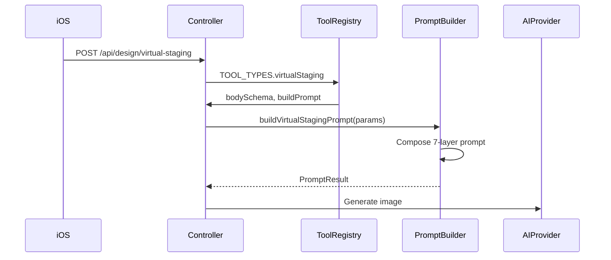

# feat: Add Virtual Staging Tool Backend

## Overview

Adding backend support for the Virtual Staging tool. The iOS wizard is already implemented with a 4-step flow (Photo Upload → Room Type → Style → Color Palette). This plan covers the backend API endpoint, prompt builder, Zod schema, and tool registry integration to complete the end-to-end flow.

## Problem Frame

Virtual Staging is designed for empty or sparsely furnished rooms — the AI adds furniture and decor to stage the space, unlike Interior Design which transforms existing furnishings. The iOS app has the full wizard UI but the backend endpoint does not exist, so generations cannot be submitted.

## Requirements Trace

- R1. Create `/api/design/virtual-staging` POST endpoint following existing tool patterns
- R2. Add `CreateVirtualStagingBody` Zod schema with: imageUrl, roomType, designStyle, colorPalette, stagingMode
- R3. Build prompt that stages empty/sparse rooms with furniture matching the selected style and palette
- R4. Register in `TOOL_TYPES` so the generic controller factory handles routing, validation, and processing
- R5. Add `stagingColorPalettes` dictionary (reuse exterior/garden palette structure)
- R6. Prompt must differentiate from Interior Design: "Add furniture and decor to this empty room" vs "Transform existing furniture"
- R7. Support two staging modes: `keepLayout` (preserve any existing furniture, add complementary pieces) and `fullStaging` (stage as if empty)

## Scope Boundaries

- NOT implementing iOS changes (already complete)
- NOT adding new AI providers
- NOT changing the existing Cloud Tasks pipeline
- NOT adding rate limiting config (can reuse existing tool-level limits)

## Context & Research

### Relevant Code and Patterns

**Tool Registry Pattern:**

```1:30:src/lib/tool-types.ts
// Each tool is a self-describing record: routing, validation, rate limiting,
// persistence round-trip, and prompt building all live in one place.
```

**Existing tools to follow:**
- `src/lib/prompts/tools/interior-design.ts` — closest pattern, same roomType/designStyle inputs
- `src/lib/prompts/tools/garden-design.ts` — has colorPalette + colorMode, similar to staging
- `src/lib/prompts/tools/exterior-design.ts` — has colorMode (structuralPreservation/renovationDesign)

**iOS Virtual Staging Parameters:**
- `VirtualStagingWizardViewModel.swift`: roomType, selectedStyle (DesignStyle), selectedColorPalette (ColorPalette)
- `StagingColorMode.swift`: keepLayout, fullStaging
- `ColorPalette.stagingPalettes`: 12 palettes (surpriseMe + 11 named palettes)

### Institutional Learnings

- The prompt builder pattern uses 7-layer composition with priority-based token trimming
- All tools share `structural-preservation`, `positive-avoidance`, `photography-quality` primitives
- Tool-specific dictionaries live in `src/lib/prompts/dictionaries/`
- Enum types are generated in `src/schemas/generated/types/` but Virtual Staging types don't exist yet

## Key Technical Decisions

- **Reuse existing enums**: RoomType, DesignStyle, and stagingPalettes map directly to ColorPalette.stagingPalettes from iOS — use the same 12 palette IDs from exterior palettes since they overlap
- **New staging-specific prompt builder**: Cannot reuse interior-design builder because the action directive is fundamentally different (add furniture vs transform furniture)
- **StagingMode enum**: Add `keepLayout` and `fullStaging` to match iOS `StagingColorMode`
- **guidanceBand**: Use `balanced` for fullStaging (creative freedom), `faithful` for keepLayout (preserve existing elements)

## Open Questions

### Resolved During Planning

- **Q: Should we create new StagingColorPalette type or reuse existing?**
  - Resolution: Reuse the exterior palette IDs since iOS `ColorPalette.stagingPalettes` uses the same 12 palette IDs that exteriorPalettes uses. No new dictionary needed — import `exteriorPalettes` into the staging prompt builder.

- **Q: How does keepLayout vs fullStaging affect the prompt?**
  - Resolution: `keepLayout` uses the overlay action pattern (like christmas): "Preserve existing furniture and add complementary pieces". `fullStaging` uses transform pattern: "Stage this empty room with furniture and decor".

### Deferred to Implementation

- Exact prompt phrasing will be refined based on AI output quality during testing
- Whether `stagingMode` needs a fallback when iOS sends an unexpected value

## High-Level Technical Design

> *This illustrates the intended approach and is directional guidance for review, not implementation specification. The implementing agent should treat it as context, not code to reproduce.*



**Prompt Layer Composition (priority order):**
1. Action directive + room focus (staging-specific)
2. Style core (from designStyles dictionary)
3. Structural preservation primitive
4. Positive avoidance primitive
5. Style detail (materials, signature items)
6. Photography quality primitive
7. Lighting character

## Implementation Units

- [ ] **Unit 1: Add Zod Schema and Generated Types**

**Goal:** Define the API contract for virtual staging requests

**Requirements:** R2

**Dependencies:** None

**Files:**
- Modify: `src/schemas/generated/api.ts`
- Create: `src/schemas/generated/types/stagingMode.ts`
- Modify: `src/schemas/generated/types/index.ts`

**Approach:**
- Add `CreateVirtualStagingBody` Zod schema with: imageUrl, roomType, designStyle, colorPalette, stagingMode
- Create `StagingMode` enum type: `keepLayout` | `fullStaging`
- Export from types index

**Patterns to follow:**
- `CreateInteriorDesignBody` for basic structure
- `CreateGardenDesignBody` for colorPalette + colorMode pattern

**Test scenarios:**
- Happy path: Valid body with all required fields parses successfully
- Happy path: `stagingMode: "keepLayout"` and `stagingMode: "fullStaging"` both valid
- Edge case: Missing stagingMode field fails validation
- Edge case: Invalid stagingMode value fails validation
- Edge case: colorPalette accepts all 12 valid palette IDs

**Verification:**
- Schema compiles without type errors
- Manual test with sample payloads passes Zod parse

---

- [ ] **Unit 2: Create Virtual Staging Prompt Builder**

**Goal:** Generate AI prompts that stage empty/sparse rooms with furniture

**Requirements:** R3, R6, R7

**Dependencies:** Unit 1

**Files:**
- Create: `src/lib/prompts/tools/virtual-staging.ts`
- Modify: `src/lib/prompts/types.ts` (add StagingColorPalette type alias if needed)

**Approach:**
- Follow the 7-layer composition pattern from interior-design.ts
- Branch on `stagingMode`:
  - `fullStaging`: "Stage this empty [roomType] with [style] furniture and decor"
  - `keepLayout`: "Preserve any existing furniture in this [roomType] and add complementary [style] pieces"
- Use `designStyles` dictionary for style attributes (same as interior)
- Use `exteriorPalettes` dictionary for color palette overrides
- Set guidanceBand: `faithful` for keepLayout, `balanced` for fullStaging

**Patterns to follow:**
- `src/lib/prompts/tools/interior-design.ts` for style + room composition
- `src/lib/prompts/tools/garden-design.ts` for palette override logic and colorMode branching

**Test scenarios:**
- Happy path: fullStaging mode generates "Stage this empty living room" action directive
- Happy path: keepLayout mode generates "Preserve existing furniture and add complementary" directive
- Happy path: colorPalette overrides style's native palette when not surpriseMe
- Happy path: surpriseMe colorPalette lets style drive the palette (empty swatch)
- Edge case: Unknown designStyle falls back to generic staging prompt
- Edge case: Unknown roomType falls back to generic "room" label
- Integration: Prompt includes structural-preservation and photography-quality primitives

**Verification:**
- Prompt output for a sample input (livingRoom, modern, warmTones, fullStaging) contains expected keywords
- Token budget trimming works correctly when prompt exceeds PRIMARY_MAX_TOKENS

---

- [ ] **Unit 3: Register Tool in TOOL_TYPES**

**Goal:** Wire up the endpoint so the generic controller factory handles routing

**Requirements:** R1, R4

**Dependencies:** Unit 1, Unit 2

**Files:**
- Modify: `src/lib/tool-types.ts`

**Approach:**
- Add `virtualStaging` entry to `TOOL_TYPES` object
- Configure: toolKey, routePath (`/virtual-staging`), rateLimitKey, models, bodySchema, buildPrompt
- Set imageUrlFields: `["imageUrl"]`
- Reuse same AI models as interior: `prunaai/p-image-edit` primary, `fal-ai/flux-2/klein/9b/edit` fallback

**Patterns to follow:**
- `interiorDesign` entry for basic tool registration
- `gardenDesign` entry for tool with colorPalette

**Test scenarios:**
- Happy path: POST /api/design/virtual-staging returns 202 with generationId
- Happy path: Tool appears in Swagger documentation
- Error path: Invalid body returns 400 with Zod validation message
- Error path: Missing auth returns 401
- Integration: Generation completes and produces output image

**Verification:**
- Server starts without errors
- Swagger UI shows the new endpoint with correct schema
- Manual test request queues a generation

---

- [ ] **Unit 4: Add JSON Schema for Swagger Documentation**

**Goal:** Provide OpenAPI documentation for the new endpoint

**Requirements:** R1

**Dependencies:** Unit 1

**Files:**
- Modify: `src/lib/tool-types.ts` (bodyJsonSchema section)

**Approach:**
- Add `virtualStagingBodyJsonSchema` object matching the Zod schema
- Include descriptions for each field
- Add to the TOOL_TYPES entry

**Patterns to follow:**
- `gardenBodyJsonSchema` for structure with colorPalette
- `exteriorBodyJsonSchema` for colorMode-like field

**Test scenarios:**
Test expectation: none -- pure documentation, verified visually in Swagger UI

**Verification:**
- Swagger UI displays correct field names, types, and descriptions
- Enum values for roomType, designStyle, colorPalette, stagingMode all documented

---

- [ ] **Unit 5: Add Rate Limit Configuration**

**Goal:** Configure rate limiting for the new endpoint

**Requirements:** R4

**Dependencies:** Unit 3

**Files:**
- Modify: `src/config/rate-limits.ts`

**Approach:**
- Add `virtualStaging` rate limit key with same limits as interior (or adjust based on expected usage)

**Patterns to follow:**
- Existing tool rate limit entries

**Test scenarios:**
Test expectation: none -- rate limiting behavior is implicit in the framework

**Verification:**
- Server starts without missing rate limit key error
- Rate limiting applies to the endpoint (can verify via rapid requests if needed)

## System-Wide Impact

- **Interaction graph:** Controller factory creates handler → prompt builder generates prompt → generation-processor calls AI provider → Firestore listener notifies iOS
- **Error propagation:** Unknown enum values trigger R24 graceful fallback in prompt builder, logged at warn level
- **State lifecycle risks:** None — follows existing stateless generation pattern
- **API surface parity:** New endpoint joins existing 6 tools; iOS already expects this endpoint
- **Integration coverage:** End-to-end test should verify: request → queue → AI → S3 → Firestore → push notification
- **Unchanged invariants:** Interior design endpoint behavior unchanged; this is additive

## Risks & Dependencies

| Risk | Mitigation |
|------|------------|
| Prompt quality for staging differs significantly from interior | Start with interior-like prompt, iterate based on AI output quality in staging |
| iOS sends unexpected stagingMode value | Add R24-style fallback to default to fullStaging |
| Color palette not influencing output visually | Ensure palette swatch is injected prominently in style-core layer |

## Documentation / Operational Notes

- After deployment, verify FCM notifications work for virtualStaging toolType
- iOS app may need to be updated to send the correct `stagingMode` field if it's not already

## Sources & References

- Related code: `src/lib/tool-types.ts`, `src/lib/prompts/tools/interior-design.ts`
- iOS files: `VirtualStagingWizardViewModel.swift`, `StagingColorMode.swift`, `ColorPalette.swift`
